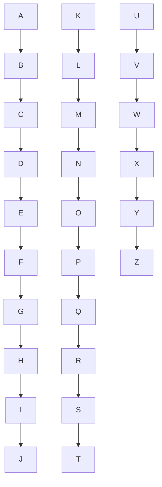
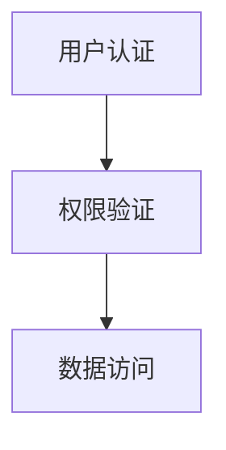
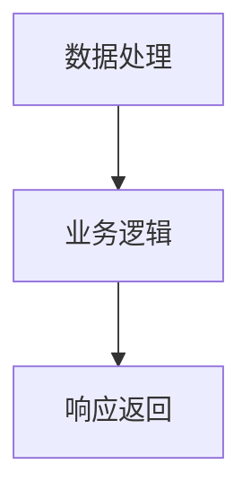
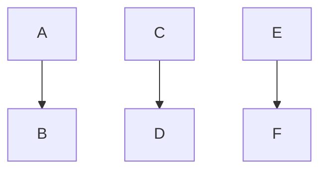
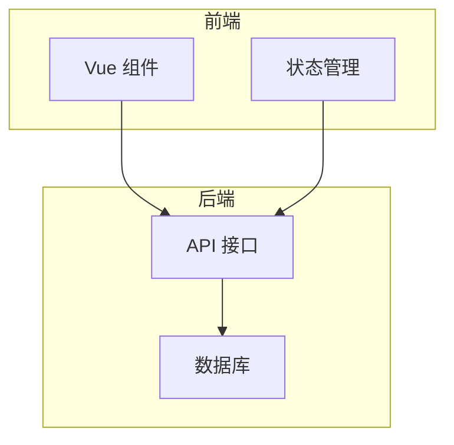
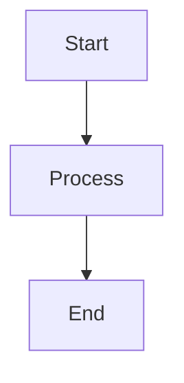
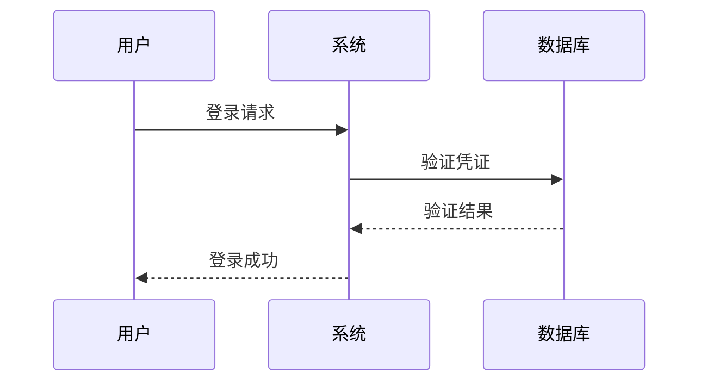
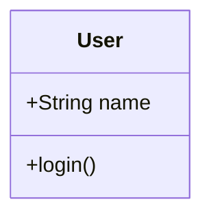

# VitePress Pro 专家技能文档

> 本文档定义 VitePress Pro 能力包的核心技能与使用指南

---

## 技能概览

VitePress Pro 提供以下专家级技能：

1. **自动侧边栏生成** - 智能扫描目录结构并生成配置
2. **Mermaid 图表优化** - 提供图表最佳实践与性能优化
3. **多语言文档同步** - 确保国际化文件结构一致性
4. **配置验证与诊断** - 实时检测配置错误并提供修复建议

---

## 技能 1：自动侧边栏生成

### 功能描述

扫描 `src/` 目录及其子目录，自动生成符合 VitePress 规范的侧边栏配置。

### 使用场景

- 新建大量文档后需要更新侧边栏
- 重构文档结构后需要重新生成配置
- 保持侧边栏与文件结构同步

### 工作原理

```typescript
/**
 * 侧边栏生成算法
 * 
 * 1. 扫描目录：递归遍历 src/ 目录
 * 2. 过滤文件：只处理 .md 文件
 * 3. 解析 Frontmatter：提取 title 和 order 字段
 * 4. 构建层级：根据目录结构生成嵌套配置
 * 5. 排序：按 order 字段或文件名排序
 * 6. 生成配置：输出 TypeScript 配置代码
 */
```

### 输入示例

```
src/
├── guide/
│   ├── getting-started.md  (order: 1)
│   ├── configuration.md    (order: 2)
│   └── advanced/
│       ├── themes.md       (order: 1)
│       └── plugins.md      (order: 2)
└── api/
    ├── overview.md
    └── reference.md
```

### 输出示例

```typescript
export const sidebarStructure: SidebarStructure = {
  '/guide/': [
    {
      id: 'guide-intro',
      items: [
        { id: 'getting-started', link: '/guide/getting-started' },
        { id: 'configuration', link: '/guide/configuration' },
      ]
    },
    {
      id: 'guide-advanced',
      collapsed: false,
      items: [
        { id: 'themes', link: '/guide/advanced/themes' },
        { id: 'plugins', link: '/guide/advanced/plugins' },
      ]
    }
  ],
  '/api/': [
    {
      id: 'api-intro',
      items: [
        { id: 'overview', link: '/api/overview' },
        { id: 'reference', link: '/api/reference' },
      ]
    }
  ]
}
```

### 使用方法

```bash
# 方法 1：通过 Kiro 命令
@vitepress-pro generateSidebar --dir src/guide

# 方法 2：通过 Agent 对话
"请为 src/guide 目录生成侧边栏配置"

# 方法 3：自动触发（编辑文件后）
# Hook 会自动检测文件变动并提示生成
```

### 配置选项

```typescript
interface SidebarGenerateOptions {
  /** 扫描的根目录 */
  baseDir: string
  
  /** 最大扫描深度 */
  maxDepth: number
  
  /** 是否默认折叠子菜单 */
  collapsed: boolean
  
  /** 排序方式 */
  sortBy: 'order' | 'name' | 'date'
  
  /** 是否包含 index.md */
  includeIndex: boolean
}
```

### 最佳实践

1. **使用 Frontmatter 控制排序**
   ```markdown
   ---
   title: 快速开始
   order: 1
   ---
   ```

2. **为目录添加 index.md**
   ```markdown
   ---
   title: 指南
   description: 完整的 VitePress 使用指南
   ---
   ```

3. **保持目录结构清晰**
   - 不超过 3 层嵌套
   - 每个目录不超过 10 个文件
   - 使用语义化的目录名

---

## 技能 2：Mermaid 图表优化

### 功能描述

分析 Markdown 中的 Mermaid 图表，提供性能优化建议和语法改进。

### 检查项

#### 2.1 性能检查

```markdown
<!-- ❌ 性能问题：节点过多（> 20） -->


<!-- ✅ 优化后：拆分为多个简单图表 -->



```

#### 2.2 语法检查

```markdown
<!-- ❌ 语法错误：箭头方向不一致 -->
```mermaid
graph TD
    A --> B
    C --> D
    E -> F  # 混用 --> 和 ->
```

<!-- ✅ 修复：统一箭头样式 -->

```

#### 2.3 可读性优化

```markdown
<!-- ❌ 可读性差：缺少标签 -->


<!-- ✅ 优化：添加清晰标签 -->

```

### 优化建议

#### 建议 1：使用子图分组



#### 建议 2：控制图表复杂度

| 图表类型 | 建议节点数 | 最大节点数 |
|---------|----------|-----------|
| 流程图 | 5-10 | 15 |
| 时序图 | 3-5 | 8 |
| 类图 | 3-8 | 12 |
| 状态图 | 5-10 | 15 |

#### 建议 3：选择合适的图表类型

```markdown
<!-- 流程图：表示步骤流程 -->


<!-- 时序图：表示交互过程 -->


<!-- 类图：表示数据结构 -->

```

### 使用方法

```bash
# 分析当前文件中的所有 Mermaid 图表
@vitepress-pro optimizeMermaid --file src/guide/architecture.md

# 批量分析目录
@vitepress-pro optimizeMermaid --dir src/guide

# 获取优化报告
"请分析这个 Mermaid 图表的性能问题"
```

---

## 技能 3：多语言文档同步

### 功能描述

检测中英越三语文档的文件结构一致性，自动发现缺失或多余的文件。

### 检查规则

#### 规则 1：文件结构镜像

```
✅ 正确：三语文件结构完全对齐
src/
├── guide/
│   ├── getting-started.md      # 中文
│   └── configuration.md
├── en/
│   └── guide/
│       ├── getting-started.md  # 英文（镜像）
│       └── configuration.md
└── vi/
    └── guide/
        ├── getting-started.md  # 越南语（镜像）
        └── configuration.md

❌ 错误：英文版缺少 configuration.md
src/
├── guide/
│   ├── getting-started.md
│   └── configuration.md        # 中文有
├── en/
│   └── guide/
│       └── getting-started.md  # 英文缺少
└── vi/
    └── guide/
        ├── getting-started.md
        └── configuration.md
```

#### 规则 2：文件命名一致

```
✅ 正确：文件名完全一致
src/guide/getting-started.md
src/en/guide/getting-started.md
src/vi/guide/getting-started.md

❌ 错误：文件名不一致
src/guide/getting-started.md
src/en/guide/get-started.md      # 命名不一致
src/vi/guide/getting-started.md
```

### 检查报告示例

```
🔍 多语言文档同步检查报告
━━━━━━━━━━━━━━━━━━━━━━━━━━━━━━━━━━━━━━━━━━━━━

📊 统计信息：
  - 中文文档：25 个文件
  - 英文文档：23 个文件  ⚠️
  - 越南语文档：25 个文件

❌ 发现问题：

1. 英文版缺少以下文件：
   - src/en/guide/advanced/custom-theme.md
   - src/en/api/plugin-api.md

2. 英文版多余以下文件：
   - src/en/guide/deprecated.md  (中文版已删除)

✅ 建议操作：

1. 创建缺失的英文文档：
   ```bash
   touch src/en/guide/advanced/custom-theme.md
   touch src/en/api/plugin-api.md
   ```

2. 删除多余的英文文档：
   ```bash
   rm src/en/guide/deprecated.md
   ```
```

### 使用方法

```bash
# 检查所有语言的同步状态
@vitepress-pro syncI18n

# 检查特定目录
@vitepress-pro syncI18n --dir src/guide

# 自动修复（创建缺失文件）
@vitepress-pro syncI18n --auto-fix

# 生成同步报告
@vitepress-pro syncI18n --report
```

### 自动修复选项

```typescript
interface I18nSyncOptions {
  /** 是否自动创建缺失文件 */
  autoCreate: boolean
  
  /** 是否自动删除多余文件 */
  autoDelete: boolean
  
  /** 创建文件时的模板 */
  template: 'empty' | 'placeholder' | 'copy-from-zh'
  
  /** 是否生成详细报告 */
  verbose: boolean
}
```

---

## 技能 4：配置验证与诊断

### 功能描述

实时验证 VitePress 配置文件的语法和结构，提供错误修复建议。

### 检查项

#### 4.1 配置语法检查

```typescript
// ❌ 错误：缺少必需字段
export default defineConfig({
  themeConfig: {
    nav: []  // 缺少 sidebar 配置
  }
})

// ✅ 修复建议
export default defineConfig({
  themeConfig: {
    nav: [],
    sidebar: {}  // 添加 sidebar 配置
  }
})
```

#### 4.2 路径有效性检查

```typescript
// ❌ 错误：链接指向不存在的文件
{
  nav: [
    { text: '指南', link: '/guide/start' }  // 文件不存在
  ]
}

// ✅ 修复建议
{
  nav: [
    { text: '指南', link: '/guide/getting-started' }  // 正确路径
  ]
}
```

#### 4.3 类型一致性检查

```typescript
// ❌ 错误：类型不匹配
export const siteConfig = {
  base: 123  // 应为 string
}

// ✅ 修复建议
export const siteConfig = {
  base: '/'  // 正确类型
}
```

### 诊断报告示例

```
🔧 VitePress 配置诊断报告
━━━━━━━━━━━━━━━━━━━━━━━━━━━━━━━━━━━━━━━━━━━━━

📂 检查文件：.vitepress/config.ts

✅ 配置结构正确

⚠️  发现 2 个警告：

1. 导航链接 '/guide/start' 指向的文件不存在
   位置：.vitepress/config/shared/nav.config.ts:15
   建议：将链接改为 '/guide/getting-started'

2. 侧边栏配置深度过深（4 层）
   位置：.vitepress/config/shared/sidebar.config.ts:42
   建议：建议最大深度为 3 层

🎯 修复建议：

1. 更新导航链接：
   ```diff
   - { text: '指南', link: '/guide/start' }
   + { text: '指南', link: '/guide/getting-started' }
   ```

2. 简化侧边栏结构：
   考虑将深层级内容提升或合并
```

### 使用方法

```bash
# 验证配置文件
@vitepress-pro validateConfig

# 检查特定配置文件
@vitepress-pro validateConfig --file .vitepress/config/site.ts

# 生成详细诊断报告
@vitepress-pro validateConfig --detailed

# 自动修复简单问题
@vitepress-pro validateConfig --auto-fix
```

---

## 高级功能

### 批处理模式

```bash
# 一次性执行所有检查
@vitepress-pro check-all

# 输出：
# ✅ 侧边栏配置正确
# ✅ Mermaid 图表优化
# ⚠️  发现 2 个文档同步问题
# ✅ 配置验证通过
```

### 集成到 CI/CD

```yaml
# .github/workflows/docs-check.yml
- name: VitePress Pro Check
  run: |
    kiro power vitepress-pro check-all
```

### 自定义规则

```typescript
// .kiro/powers/vitepress-pro/custom-rules.ts
export const customRules = {
  maxMermaidNodes: 15,
  sidebarMaxDepth: 3,
  i18nStrictMode: true,
}
```

---

## 常见问题

### Q1: 侧边栏生成后需要手动翻译吗？

A: 是的。生成的配置使用 ID 标识，需要在 `.vitepress/config/locales/` 对应的翻译文件中添加翻译文本。

### Q2: Mermaid 优化会修改原始文件吗？

A: 不会。优化工具只提供建议，不会直接修改文件。您可以选择接受建议后手动修改。

### Q3: 多语言同步检查会自动创建文件吗？

A: 默认不会。使用 `--auto-fix` 选项可以自动创建缺失文件（使用空白模板）。

### Q4: 配置验证支持哪些文件？

A: 支持所有 `.vitepress/config/` 目录下的 TypeScript 文件。

---

## 更新日志

### v1.0.0 (2024-10-03)

- ✨ 初始发布
- ✨ 实现自动侧边栏生成
- ✨ 实现 Mermaid 图表优化
- ✨ 实现多语言文档同步
- ✨ 实现配置验证与诊断

---

**文档版本：** 1.0.0  
**最后更新：** 2024-10-03  
**维护者：** VitePress Pro Team
