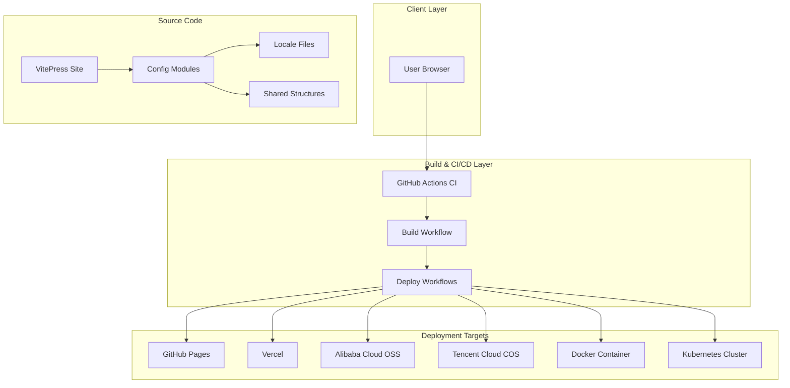
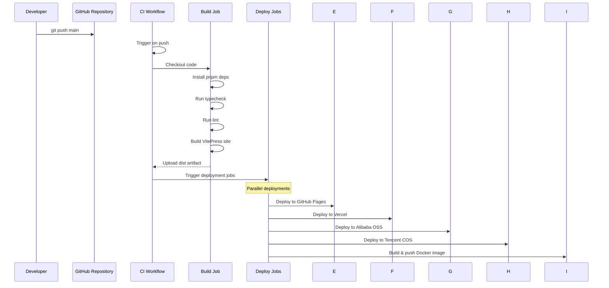
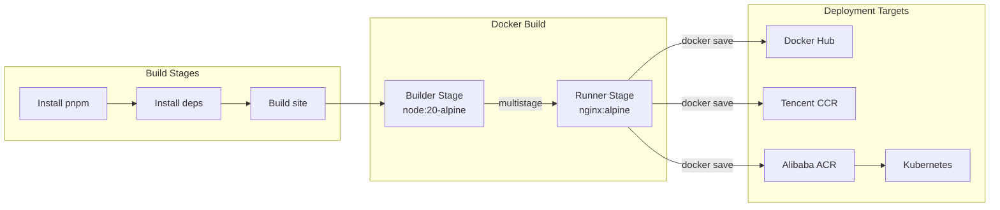

# Design Document: VitePress Scaffolding Project

## Overview

This document defines the technical design for a comprehensive VitePress scaffolding project that provides a production-ready foundation for building multi-language documentation sites. The project supports Chinese, English, and Vietnamese languages with modern engineering configurations including TypeScript strict mode, ESLint with @antfu/eslint-config, Husky + lint-staged for Git hooks, Commitlint for conventional commits, and comprehensive CI/CD pipelines for multiple deployment targets (GitHub Pages, Vercel, Alibaba Cloud OSS, Tencent Cloud COS, Docker/Kubernetes).

The design follows the "Both" approach, combining high-level architecture diagrams and interfaces with detailed code-first implementations using Structured Pseudocode.

## Architecture

### System Architecture



### CI/CD Workflow Flow



### Docker Architecture



## Components and Interfaces

### 1. Configuration Management System

**Purpose**: Modular configuration management with type safety and validation

**Interface**:
```pascal
INTERFACE IConfigurationManager
  METHOD mergeSharedWithLocale(
    sharedConfig: SharedConfig,
    localeTexts: LocaleTexts,
    localePrefix: String
  ): MergedConfig

  METHOD validateConfig(
    config: AppConfig,
    locale: String
  ): ValidationResponse

  METHOD getEnvVariable(
    name: String,
    defaultValue: String
  ): String
END INTERFACE

INTERFACE IEnvValidator
  METHOD validateProduction(
    requiredVars: Array[String]
  ): ValidationResult

  METHOD validateDevelopment(
    optionalVars: Array[String]
  ): ValidationResult
END INTERFACE

INTERFACE IConfigValidator
  METHOD validateNavTranslations(
    structure: NavStructure,
    translations: Translations
  ): Boolean

  METHOD validateSidebarTranslations(
    structure: SidebarStructure,
    translations: Translations
  ): Boolean

  METHOD validateAllLocales(
    locales: Array[String]
  ): ValidationResult
END INTERFACE
```

**Responsibilities**:
- Merge shared configuration structures with locale-specific translations
- Validate required environment variables
- Check translation completeness across all locales
- Provide clear error messages with file locations

### 2. Deployment Workflow Manager

**Purpose**: Coordinate multi-platform deployment tasks

**Interface**:
```pascal
INTERFACE IDeploymentManager
  METHOD deployToGitHubPages(
    distPath: String,
    token: String
  ): DeploymentResult

  METHOD deployToVercel(
    distPath: String,
    token: String,
    orgId: String,
    projectId: String
  ): DeploymentResult

  METHOD deployToOSS(
    distPath: String,
    region: String,
    accessKeyId: String,
    accessKeySecret: String,
    bucket: String,
    prefix: String
  ): DeploymentResult

  METHOD deployToCOS(
    distPath: String,
    secretId: String,
    secretKey: String,
    bucket: String,
    region: String,
    prefix: String
  ): DeploymentResult

  METHOD buildDockerImage(
    tag: String,
    pushToRegistries: Array[String]
  ): ImageBuildResult
END INTERFACE

TYPE DeploymentResult = {
  success: Boolean
  url: String
  duration: Number
  errors: Array[String]
}
```

**Responsibilities**:
- Build VitePress documentation
- Deploy to multiple platforms in parallel
- Handle authentication for each platform
- Generate deployment summaries
- Provide error recovery mechanisms

### 3. Internationalization System

**Purpose**: Multi-language support with automatic URL prefixing

**Interface**:
```pascal
INTERFACE II18nManager
  METHOD getAvailableLocales(): Array[Locale]

  METHOD getLocalePrefix(locale: String): String

  METHOD resolveLocaleFromPath(path: String): Locale

  METHOD switchLocale(
    currentLocale: String,
    targetLocale: String,
    currentPath: String
  ): String

  METHOD synchronizeStructure(
    sourceLocale: String,
    targetLocales: Array[String]
  ): SynchronizationResult
END INTERFACE

INTERFACE ILocaleFileHandler
  METHOD loadLocaleFiles(
    locale: String
  ): LocaleFiles

  METHOD validateLocaleFiles(
    locale: String
  ): ValidationResponse

  METHOD scaffoldMissingFiles(
    sourceLocale: String,
    targetLocale: String
  ): Array[String]
END INTERFACE
```

**Responsibilities**:
- Manage locale configurations
- Handle URL prefixing for different languages
- Validate translation completeness
- Scaffold missing translation files

## Data Models

### 1. Configuration Models

```pascal
STRUCTURE AppConfig
  site: SiteConfig
  seo: SeoConfig
  i18n: I18nConfig
  markdown: MarkdownConfig
  theme: ThemeConfig
  vite: ViteConfig
END STRUCTURE

STRUCTURE SiteConfig
  base: String
  srcDir: String
  outDir: String
  cleanUrls: Boolean
  lastUpdated: Boolean
  appearance: Boolean
  sitemap: SitemapConfig
  vite: ViteBuildConfig
END STRUCTURE

STRUCTURE I18nConfig
  locales: Array[LocaleDefinition]
  defaultLocale: String
  rootLabel: String
END STRUCTURE

STRUCTURE LocaleDefinition
  label: String
  lang: String
  link: String
  metadata: Metadata
  themeConfig: ThemeConfig
END STRUCTURE

STRUCTURE Metadata
  title: String
  description: String
  lang: String
  titleTemplate: String
END STRUCTURE
```

**Validation Rules**:
- `base` must start and end with `/`
- `outDir` must be `./dist` (enforced)
- `srcDir` must be `./src`
- All locale links must end with `/`
- Title template must contain `{title}` placeholder

### 2. Navigation Structure Model

```pascal
STRUCTURE NavStructureItem
  id: String  // Unique identifier matching translation keys
  link?: String  // Route path (language prefix added automatically)
  items?: Array[NavStructureItem]  // Dropdown menu items
  external?: Boolean  // External links don't get language prefix
END STRUCTURE

STRUCTURE NavTranslation
  id: String
  text: String
END STRUCTURE

STRUCTURE MergedNavItem
  text: String
  link: String
  items?: Array[MergedNavItem]
  external?: Boolean
END STRUCTURE
```

**Validation Rules**:
- Each `id` must have a corresponding translation key
- `link` paths must be relative and start with `/`
- External links must include full URL with protocol
- Dropdown items must have at least one child

### 3. Sidebar Structure Model

```pascal
STRUCTURE SidebarGroup
  groupId: String  // Group title identifier
  collapsed?: Boolean  // Whether group is collapsed by default
  items: Array[SidebarItem]
END STRUCTURE

STRUCTURE SidebarItem
  id: String  // Item identifier matching translation keys
  link: String  // Document path
END STRUCTURE

STRUCTURE SidebarGroupTranslation
  groupId: String
  text: String
END STRUCTURE
```

**Validation Rules**:
- `groupId` must have corresponding translation
- All `id` values must have translations
- Links must point to existing Markdown files

### 4. Environment Variable Model

```pascal
STRUCTURE EnvConfig
  name: String
  required: Boolean
  defaultValue?: String
  description: String
  validate?: Func[String]: Boolean
END STRUCTURE

STRUCTURE EnvValidationResult
  success: Boolean
  errors: Array[String]
  warnings: Array[String]
  validVars: Array[EnvConfig]
END STRUCTURE
```

## Algorithmic Pseudocode

### Main Build Workflow

```pascal
ALGORITHM buildDocumentationSite
INPUT: sourceDir (String), outputDir (String)
OUTPUT: BuildResult

BEGIN
  // Step 1: Validate environment variables
  ENV_VAR_RESULT ← validateEnvVariables()
  
  IF NOT ENV_VAR_RESULT.success THEN
    RETURN BuildResult(success: false, errors: ENV_VAR_RESULT.errors)
  END IF
  
  // Step 2: Validate all locale configurations
  LOCALE_RESULT ← validateAllLocales()
  
  IF NOT LOCALE_RESULT.success THEN
    RETURN BuildResult(success: false, errors: LOCALE_RESULT.errors)
  END IF
  
  // Step 3: Load shared configuration structures
  NAV_STRUCTURE ← loadSharedNavStructure()
  SIDEBAR_STRUCTURE ← loadSharedSidebarStructure()
  SEARCH_CONFIG ← loadSearchConfig()
  
  // Step 4: Load locale-specific translations
  LOCALES ← ['zh', 'en', 'vi']
  LOCALE_TRANSLATIONS ← {}  // Map of locale -> translations
  
  FOR EACH locale IN LOCALES DO
    LOCALE_TRANSLATIONS[locale] ← {
      nav: loadTranslations(locale, 'nav'),
      sidebar: loadTranslations(locale, 'sidebar'),
      search: loadTranslations(locale, 'search'),
      ui: loadTranslations(locale, 'ui'),
      meta: loadTranslations(locale, 'meta')
    }
  END FOR
  
  // Step 5: Merge configurations for each locale
  MERGED_CONFIGS ← {}  // Map of locale -> merged config
  
  FOR EACH locale IN LOCALES DO
    MERGED_CONFIGS[locale] ← {
      themeConfig: mergeThemeConfig(
        NAV_STRUCTURE,
        LOCALE_TRANSLATIONS[locale].nav,
        SIDEBAR_STRUCTURE,
        LOCALE_TRANSLATIONS[locale].sidebar,
        locale
      ),
      search: mergeSearchConfig(
        SEARCH_CONFIG,
        LOCALE_TRANSLATIONS[locale].search
      )
    }
  END FOR
  
  // Step 6: Build site with VitePress
  BUILD_OUTPUT ← vitepressBuild({
    srcDir: sourceDir,
    outDir: outputDir,
    locales: MERGED_CONFIGS
  })
  
  // Step 7: Validate build output
  IF NOT directoryExists(outputDir) OR isEmpty(outputDir) THEN
    RETURN BuildResult(success: false, errors: ['Build output is empty'])
  END IF
  
  RETURN BuildResult(success: true, outputDir: outputDir)
END
```

**Preconditions**:
- Source directory contains valid VitePress site structure
- All required environment variables are set
- All locale files are complete and valid

**Postconditions**:
- Build artifacts are generated in output directory
- All locales are properly configured
- No translation keys are missing

**Loop Invariants**:
- All translation files maintain consistent structure across locales
- Navigation items always have corresponding translations

### Configuration Merging Algorithm

```pascal
ALGORITHM mergeNavStructure
INPUT: structure (Array[NavStructureItem]), 
       translations (Map[String, String]), 
       locale (String)
OUTPUT: Array[MergedNavItem]

BEGIN
  LOCALE_PREFIX ← getLocalePrefix(locale)
  MERGED_ITEMS ← []  // Result array
  
  FOR EACH item IN structure DO
    // Get translated text for this item
    TRANSLATED_TEXT ← translations[item.id] OR item.id
    
    // Build link with locale prefix if not external
    IF item.external THEN
      LINK ← item.link
    ELSE
      LINK ← CONCAT(LOCALE_PREFIX, item.link)
    END IF
    
    // Process dropdown menu items if present
    IF item.items IS NOT NULL THEN
      SUB_ITEMS ← []  // Process sub-items recursively
      
      FOR EACH subItem IN item.items DO
        SUB_TRANSLATED ← translations[subItem.id] OR subItem.id
        
        IF subItem.external THEN
          SUB_LINK ← subItem.link
        ELSE
          SUB_LINK ← CONCAT(LOCALE_PREFIX, subItem.link)
        END IF
        
        SUB_ITEMS.append({
          text: SUB_TRANSLATED,
          link: SUB_LINK,
          external: subItem.external
        })
      END FOR
      
      MERGED_ITEMS.append({
        text: TRANSLATED_TEXT,
        items: SUB_ITEMS
      })
    ELSE
      // Simple link item
      MERGED_ITEMS.append({
        text: TRANSLATED_TEXT,
        link: LINK
      })
    END IF
  END FOR
  
  RETURN MERGED_ITEMS
END
```

**Preconditions**:
- Structure is well-formed with valid IDs
- Translation map contains all required keys
- Locale string is valid (one of: '', 'en', 'vi')

**Postconditions**:
- All navigation items have translated text
- Links have correct locale prefixes
- External links are preserved without modification

### Translation Validation Algorithm

```pascal
ALGORITHM validateTranslationCompleteness
INPUT: structure (Array[NavStructureItem] or SidebarGroup[]), 
       translations (Map[String, String]), 
       locale (String)
OUTPUT: ValidationResult

BEGIN
  MISSING_KEYS ← []  // Collect all missing translation keys
  PROCESSED_KEYS ← Set()  // Track processed keys for validation
  
  // Process structure recursively
  PROCEDURE checkItem(item)
    // Check if translation exists for this item's ID
    IF NOT translations.contains(item.id) THEN
      MISSING_KEYS.append(item.id)
    ELSE
      PROCESSED_KEYS.add(item.id)
    END IF
    
    // Recursively check sub-items
    IF item.items IS NOT NULL THEN
      FOR EACH subItem IN item.items DO
        checkItem(subItem)
      END FOR
    END IF
  END PROCEDURE
  
  // Process all items in structure
  FOR EACH item IN structure DO
    checkItem(item)
  END FOR
  
  // Check for unused translations (potential orphaned keys)
  FOR EACH key IN translations.keys() DO
    IF NOT PROCESSED_KEYS.contains(key) THEN
      MISSING_KEYS.append('unused:' + key)
    END IF
  END FOR
  
  // Return validation result
  IF MISSING_KEYS.isEmpty() THEN
    RETURN ValidationResult(success: true, missingKeys: [])
  ELSE
    RETURN ValidationResult(
      success: false, 
      missingKeys: MISSING_KEYS,
      locale: locale
    )
  END IF
END
```

**Preconditions**:
- Structure contains valid item IDs
- Translation map is properly initialized

**Postconditions**:
- All IDs have corresponding translations
- No orphaned translation keys remain

**Loop Invariants**:
- All processed keys are tracked in PROCESSED_KEYS
- Missing keys are accumulated in MISSING_KEYS

### Docker Build Algorithm

```pascal
ALGORITHM buildAndPushDockerImage
INPUT: imageTag (String), 
       registries (Array[RegistryConfig])
OUTPUT: BuildResult

BEGIN
  // Step 1: Validate Dockerfile exists
  IF NOT fileExists('Dockerfile') THEN
    RETURN BuildResult(success: false, errors: ['Dockerfile not found'])
  END IF
  
  // Step 2: Build Docker image
  BUILD_OUTPUT ← dockerBuild({
    context: '.',
    file: 'Dockerfile',
    tags: [imageTag],
    load: true
  })
  
  IF NOT BUILD_OUTPUT.success THEN
    RETURN BuildResult(success: false, errors: BUILD_OUTPUT.errors)
  END IF
  
  // Step 3: Run health check
  CONTAINER_ID ← dockerRun({
    image: imageTag,
    ports: ['8080:80'],
    detach: true
  })
  
  WAIT(5 seconds)
  
  HEALTH_CHECK ← dockerExec({
    container: CONTAINER_ID,
    command: ['curl', '-f', 'http://localhost/']
  })
  
  IF NOT HEALTH_CHECK.success THEN
    dockerStop(CONTAINER_ID)
    RETURN BuildResult(success: false, errors: ['Health check failed'])
  END IF
  
  dockerStop(CONTAINER_ID)
  
  // Step 4: Push to registries
  PUSH_RESULTS ← []  // Track push results for each registry
  
  FOR EACH registry IN registries DO
    // Tag image for registry
    TAGGED_IMAGE ← CONCAT(registry.url, '/', imageTag)
    dockerTag(imageTag, TAGGED_IMAGE)
    
    // Login to registry
    LOGIN_RESULT ← dockerLogin({
      registry: registry.url,
      username: registry.username,
      password: registry.password
    })
    
    IF NOT LOGIN_RESULT.success THEN
      PUSH_RESULTS.append({
        registry: registry.name,
        success: false,
        error: LOGIN_RESULT.error
      })
      CONTINUE
    END IF
    
    // Push image
    PUSH_RESULT ← dockerPush(TAGGED_IMAGE)
    
    PUSH_RESULTS.append({
      registry: registry.name,
      success: PUSH_RESULT.success,
      error: PUSH_RESULT.error
    })
    
    dockerLogout(registry.url)
  END FOR
  
  // Return combined result
  ALL_SUCCESS ← TRUE
  
  FOR EACH result IN PUSH_RESULTS DO
    IF NOT result.success THEN
      ALL_SUCCESS ← FALSE
    END IF
  END FOR
  
  RETURN BuildResult(
    success: ALL_SUCCESS,
    pushResults: PUSH_RESULTS
  )
END
```

**Preconditions**:
- Dockerfile is properly configured
- Registry credentials are valid
- Image tag follows naming convention

**Postconditions**:
- Image is built successfully
- Health check passes
- Image is pushed to all configured registries

**Loop Invariants**:
- Login state is properly managed for each registry
- Failed pushes don't prevent processing of remaining registries

## Key Functions with Formal Specifications

### Function 1: mergeNav()

```pascal
FUNCTION mergeNav(
  structure: Array[NavStructureItem],
  translations: Map[String, String],
  locale: String
): Array[MergedNavItem]

PRECONDITIONS:
  - structure is a non-null array of NavStructureItem
  - translations contains all IDs from structure (with possible extra keys)
  - locale is one of: '', 'en', 'vi' (empty string for default locale)
  - All item.id values exist in translations map

POSTCONDITIONS:
  - Returns array of MergedNavItem with same structure as input
  - Each nav item has text field set to translations[item.id]
  - Links are prefixed with locale path if not external
  - Dropdown items (items field) are processed recursively

LOOP INVARIANTS:
  - For external links: link = item.link (no prefix added)
  - For internal links: link = '/' + locale + item.link
  - Sub-items maintain same recursive structure as parent
```

### Function 2: validateEnvVariables()

```pascal
FUNCTION validateEnvVariables(
  isProduction: Boolean
): EnvValidationResult

PRECONDITIONS:
  - isProduction is a boolean flag indicating environment type

POSTCONDITIONS:
  - Returns EnvValidationResult with success flag
  - All required environment variables are set
  - Environment variable formats are validated
  - Missing required variables cause failure in production

SIDE EFFECTS:
  - Prints validation status to console
  - Throws error if required variables are missing in production
```

### Function 3: buildDocumentationSite()

```pascal
FUNCTION buildDocumentationSite(
  sourceDir: String,
  outputDir: String
): BuildResult

PRECONDITIONS:
  - sourceDir contains valid VitePress site structure
  - All locale files exist in .vitepress/config/locales/
  - All required environment variables are set
  - Configurations are properly structured

POSTCONDITIONS:
  - Returns BuildResult with success flag
  - Build artifacts are generated in outputDir
  - All locales are properly configured
  - No translation keys are missing

ERROR CONDITIONS:
  - Missing environment variables
  - Invalid locale structure
  - Build process fails
  - Output directory is empty
```

### Function 4: deployToGitHubPages()

```pascal
FUNCTION deployToGitHubPages(
  distPath: String,
  token: String
): DeploymentResult

PRECONDITIONS:
  - distPath contains valid build artifacts
  - token has appropriate GitHub permissions
  - Repository is configured for GitHub Pages

POSTCONDITIONS:
  - Returns DeploymentResult with success flag
  - Deployment URL is provided on success
  - Any errors are captured in errors array

SIDE EFFECTS:
  - Uploads distPath to GitHub Pages
  - Updates GitHub Pages deployment status
```

## Example Usage

### Basic Build Usage

```pascal
SEQUENCE
  // Step 1: Validate environment
  ENV_RESULT ← validateEnvVariables(true)
  
  IF NOT ENV_RESULT.success THEN
    DISPLAY "Environment validation failed:"
    FOR EACH error IN ENV_RESULT.errors DO
      DISPLAY "  - " + error
    END FOR
    EXIT 1
  END IF
  
  // Step 2: Build site
  BUILD_RESULT ← buildDocumentationSite('./src', './dist')
  
  IF NOT BUILD_RESULT.success THEN
    DISPLAY "Build failed:"
    FOR EACH error IN BUILD_RESULT.errors DO
      DISPLAY "  - " + error
    END FOR
    EXIT 1
  END IF
  
  DISPLAY "✓ Build successful: " + BUILD_RESULT.outputDir
END SEQUENCE
```

### Multi-Language Configuration

```pascal
SEQUENCE
  // Load shared structure
  NAV_STRUCTURE ← loadSharedNavStructure()
  
  // Load translations for each locale
  ZH_NAV ← loadTranslations('zh', 'nav')
  EN_NAV ← loadTranslations('en', 'nav')
  VI_NAV ← loadTranslations('vi', 'nav')
  
  // Merge configurations
  ZH_NAV_CONFIG ← mergeNav(NAV_STRUCTURE, ZH_NAV, '')
  EN_NAV_CONFIG ← mergeNav(NAV_STRUCTURE, EN_NAV, 'en')
  VI_NAV_CONFIG ← mergeNav(NAV_STRUCTURE, VI_NAV, 'vi')
  
  // Output merged configurations for debugging
  DEBUG_PRINT(ZH_NAV_CONFIG)
  DEBUG_PRINT(EN_NAV_CONFIG)
  DEBUG_PRINT(VI_NAV_CONFIG)
END SEQUENCE
```

### Docker Deployment

```pascal
SEQUENCE
  // Set environment
  IMAGE_TAG ← 'vitepress-docs:latest'
  REGISTRIES ← [
    {
      name: 'Docker Hub',
      url: 'registry.hub.docker.com',
      username: DOCKERHUB_USERNAME,
      password: DOCKERHUB_TOKEN
    },
    {
      name: 'Tencent Cloud CCR',
      url: 'ccr.ccs.tencentyun.com',
      username: TENCENT_CLOUD_SECRET_ID,
      password: TENCENT_CLOUD_SECRET_KEY
    }
  ]
  
  // Build and push image
  BUILD_RESULT ← buildAndPushDockerImage(IMAGE_TAG, REGISTRIES)
  
  IF NOT BUILD_RESULT.success THEN
    DISPLAY "Docker build/push failed:"
    FOR EACH result IN BUILD_RESULT.pushResults DO
      IF NOT result.success THEN
        DISPLAY "  - " + result.registry + ": " + result.error
      END IF
    END FOR
    EXIT 1
  END IF
  
  DISPLAY "✓ Docker image built and pushed successfully"
END SEQUENCE
```

### Validation Example

```pascal
SEQUENCE
  // Validate all locales
  LOCALES ← ['zh', 'en', 'vi']
  
  FOR EACH locale IN LOCALES DO
    STRUCTURE ← loadSharedNavStructure()
    TRANSLATIONS ← loadTranslations(locale, 'nav')
    
    RESULT ← validateTranslationCompleteness(STRUCTURE, TRANSLATIONS, locale)
    
    IF NOT RESULT.success THEN
      DISPLAY "Validation failed for locale '" + locale + "':"
      FOR EACH key IN RESULT.missingKeys DO
        DISPLAY "  - " + key
      END FOR
    ELSE
      DISPLAY "✓ Locale '" + locale + "' validated successfully"
    END IF
  END FOR
END SEQUENCE
```

## Correctness Properties

### Property 1: Navigation Translation Completeness

**Validates: Requirements 17.1, 17.3**

**Universal Quantification**:
```
∀ locale ∈ {'zh', 'en', 'vi'}:
  ∀ item ∈ navStructure:
    item.id ∈ translations[locale]
```

**Test Description**: **Validates: Requirements 17.1, 17.3** Verify that every navigation item ID has a corresponding translation in each locale's translation file.

### Property 2: Link Prefixing Consistency

**Validates: Requirements 18.1, 18.2, 18.3**

**Universal Quantification**:
```
∀ locale ∈ {'zh', 'en', 'vi'}:
  ∀ item ∈ navStructure:
    IF item.external = true THEN
      mergedItem.link = item.link
    ELSE
      mergedItem.link = '/' + locale + item.link
```

**Test Description**: **Validates: Requirement 18.3** Verify that internal links get the locale prefix while external links are preserved.

### Property 3: Build Output Determinism

**Validates: Requirements 11.2, 12.4**

**Universal Quantification**:
```
∀ sourceDir, outputDir:
  ∀ run1, run2 ∈ buildDocumentationSite(sourceDir, outputDir):
    hash(outputDir) = identical
```

**Test Description**: Verify that building the same source directory produces identical output.

### Property 4: Multi-Registry Deployment Isolation

**Validates: Requirements 10.1, 10.2, 10.3, 10.4**

**Universal Quantification**:
```
∀ registries ∈ Array[RegistryConfig]:
  ∀ success ∈ pushToRegistries(registries):
    ∀ registry ∈ registries:
      IF registry success = false THEN
        other registries are not affected
```

**Test Description**: Verify that failure to push to one registry doesn't prevent pushing to others.

## Error Handling

**Validates: Requirements 10.4, 12.5, 15.4**

### Error Scenario 1: Missing Environment Variables

**Condition**: Required environment variables are not set before build
**Response**: Build process terminates with detailed error message listing missing variables
**Recovery**: User must create appropriate `.env` files with required variables

### Error Scenario 2: Missing Translation Keys

**Condition**: Navigation or sidebar items lack corresponding translations
**Response**: Build process terminates with list of missing translation keys and their locations
**Recovery**: User must add missing translation keys to locale-specific files

### Error Scenario 3: Build Output Empty

**Condition**: Build process completes but output directory is empty
**Response**: Build process terminates with error message indicating build failure
**Recovery**: User must check VitePress build logs and configuration

### Error Scenario 4: Docker Build Failure

**Condition**: Docker build process fails at any stage
**Response**: Build process terminates with error message from Docker
**Recovery**: User must fix Dockerfile or build context issues

### Error Scenario 5: Deployment Authentication Failure

**Condition**: Deployment fails due to invalid credentials or insufficient permissions
**Response**: Deployment process terminates with authentication error message
**Recovery**: User must verify credentials in GitHub Secrets or platform-specific settings

## Testing Strategy

**Validates: Requirements 5.5, 8.5, 9.5**

### Unit Testing Approach

**Test Framework**: Vitest or Jest

**Key Test Cases**:
1. `mergeNav()` with various structure and translation combinations
2. `mergeSidebar()` with nested groups and items
3. `validateEnvVariables()` for development and production modes
4. `validateTranslationCompleteness()` for missing and orphaned keys

**Coverage Goals**:
- 90%+ coverage for utility functions
- 80%+ coverage for configuration modules
- All edge cases covered (empty arrays, null values, invalid inputs)

### Property-Based Testing Approach

**Property Test Library**: fast-check

**Properties to Test**:
1. **Navigation Merge Idempotence**: Merging the same structure twice yields same result
2. **Translation Completeness Invariant**: Merged nav always has same number of items as source
3. **Link Prefixing Symmetry**: `mergeNav(structure, translations, 'en')` produces consistent prefix format
4. **Validation Round-Trip**: Valid config passes validation, invalid config fails

**Test Library Configuration**:
```pascal
FAST_CHECK_CONFIG ← {
  numRuns: 1000,
  maxLength: 10,
  seed: 42,
  path: 'test/results/fast-check'
}
```

### Integration Testing Approach

**Test Scenarios**:
1. **Full Build Pipeline**: End-to-end build from source to dist
2. **Multi-Language Build**: Verify all locales are built correctly
3. **Deployment Pipeline**: Simulate deployment to mock targets
4. **Docker Build**: Verify Docker image builds and health checks pass

**Test Approach**:
- Use GitHub Actions workflow mocks for CI/CD workflows
- Use Docker Compose for local integration testing
- Use mock servers for deployment target simulations

## Performance Considerations

**Validates: Requirements 11.1, 12.1, 14.1**

### Build Performance

**Current Implementation**:
- Incremental builds via VitePress cache
- Docker layer caching for dependencies
- Parallel deployment jobs in CI

**Bottlenecks**:
- Translation file loading (linear scan)
- Docker image building (computationally expensive)

**Optimization Opportunities**:
- Cache merged configurations between runs
- Parallel translation file loading
- Use buildKit for faster Docker builds

### Memory Usage

**Estimated Peak Memory**:
- Build process: ~256MB (including VitePress and Node.js overhead)
- Docker build: ~512MB (builder stage with all dependencies)
- CI runner: ~1GB (with all dependencies cached)

## Security Considerations

**Validates: Requirements 10.5, 11.4, 12.5**

### Secret Management

**Current Implementation**:
- GitHub Secrets for API tokens and credentials
- Environment variables for build-time configuration
- `.dockerignore` to exclude sensitive files from Docker images

**Security Best Practices**:
- Rotate secrets regularly
- Use OIDC for GitHub Pages deployment (no token required)
- Scan Docker images for vulnerabilities
- Use least-privilege credentials for deployments

### Attack Surface

**Reduced by**:
- Multi-stage Docker builds (smaller attack surface)
- Environment variable validation
- Secret scanning in CI/CD
- Regular dependency updates

## Dependencies

### Core Dependencies

- **VitePress 2.0.0-alpha.20**: Static site generator
- **Vue 3.5.43**: Frontend framework
- **TypeScript 5.7.3**: Type checking
- **Vite 8.3.2**: Build tool

### Development Dependencies

- **@antfu/eslint-config 9.5.1**: ESLint configuration
- **husky 9.1.7**: Git hooks
- **lint-staged 17.5.1**: Staged file linting
- **@commitlint/cli 21.2.3**: Commit message validation

### Deployment Dependencies

- **GitHub Actions**: CI/CD platform
- **Docker**: Containerization
- **Vercel CLI**: Vercel deployment
- **Alibaba Cloud SDK**: OSS deployment
- **Tencent Cloud SDK**: COS deployment

### External Services

- **GitHub Pages**: Static hosting
- **Vercel**: Edge network hosting
- **Alibaba Cloud OSS**: Object storage
- **Tencent Cloud COS**: Object storage
- **Docker Hub**: Container registry
- **Tencent Cloud CCR**: Container registry
- **Alibaba Cloud ACR**: Container registry
- **Kubernetes**: Container orchestration

## File Organization

### Directory Structure

```
.vitepress/
├── config/
│   ├── locales/              # Translation files
│   │   ├── zh/              # Chinese translations
│   │   ├── en/              # English translations
│   │   └── vi/              # Vietnamese translations
│   ├── shared/              # Shared configuration structures
│   │   ├── nav.config.ts    # Navigation structure
│   │   ├── sidebar.config.ts # Sidebar structure
│   │   ├── search.config.ts # Search configuration
│   │   └── theme.config.ts  # Theme shared settings
│   ├── utils/               # Utility functions
│   │   ├── merge-config.ts  # Configuration merging
│   │   ├── validators.ts    # Configuration validation
│   │   └── env-validator.ts # Environment validation
│   ├── i18n.ts              # Internationalization config
│   ├── site.ts              # Site configuration
│   ├── seo.ts               # SEO configuration
│   └── markdown.ts          # Markdown configuration
├── theme/                   # Theme customizations
│   └── index.ts             # Theme entry point
└── config.ts                # Main configuration entry
```

### Configuration File Naming Conventions

- **Files**: kebab-case (`nav.config.ts`, `merge-config.ts`)
- **Variables/Functions**: camelCase (`navStructure`, `mergeNav`)
- **Types/Interfaces**: PascalCase (`NavStructureItem`, `ValidationResult`)
- **Constants**: UPPER_SNAKE_CASE (`DEFAULT_LOCALE`, `OUTPUT_DIR`)
- **Directories**: kebab-case (`locales/`, `shared/`, `utils/`)

### Locale File Organization

```pascal
 locales/
├── zh/                       # Chinese locale
│   ├── nav.ts               # Navigation translations
│   ├── sidebar.ts           # Sidebar translations
│   ├── search.ts            # Search UI translations
│   ├── ui.ts                # UI component translations
│   └── meta.ts              # Page metadata
├── en/                       # English locale
│   ├── nav.ts
│   ├── sidebar.ts
│   ├── search.ts
│   ├── ui.ts
│   └── meta.ts
└── vi/                       # Vietnamese locale
    ├── nav.ts
    ├── sidebar.ts
    ├── search.ts
    ├── ui.ts
    └── meta.ts
```

## Component Designs

### Language Switcher Component

```pascal
STRUCTURE LanguageSwitcherProps
  currentLocale: String
  availableLocales: Array[LocaleDefinition]
  currentPath: String
END STRUCTURE

STRUCTURE LanguageSwitcherState
  isOpen: Boolean
  currentLocale: LocaleDefinition
END STRUCTURE

STRUCTURE LocaleDefinition
  code: String
  label: String
  link: String
END STRUCTURE
```

**Responsibilities**:
- Display current language and available options
- Navigate to equivalent page in selected language
- Handle missing translations gracefully

**Event Handlers**:
- `handleToggle()`: Toggle dropdown visibility
- `handleSwitch(locale)`: Navigate to selected language
- `handleClose()`: Close dropdown on outside click

### Navigation Configuration Structure

```pascal
STRUCTURE NavStructure
  items: Array[NavItem]
END STRUCTURE

STRUCTURE NavItem
  id: String
  link?: String
  items?: Array[NavItem]
  external?: Boolean
END STRUCTURE

STRUCTURE MergedNavItem
  text: String
  link: String
  items?: Array[MergedNavItem]
END STRUCTURE
```

### Sidebar Configuration Structure

```pascal
STRUCTURE SidebarStructure
  groups: Array[SidebarGroup]
END STRUCTURE

STRUCTURE SidebarGroup
  groupId: String
  collapsed?: Boolean
  items: Array[SidebarItem]
END STRUCTURE

STRUCTURE SidebarItem
  id: String
  link: String
END STRUCTURE

STRUCTURE MergedSidebarGroup
  text: String
  collapsed: Boolean
  items: Array[MergedSidebarItem]
END STRUCTURE

STRUCTURE MergedSidebarItem
  text: String
  link: String
END STRUCTURE
```

### Search Configuration

```pascal
STRUCTURE SearchConfig
  provider: 'local'
  options: SearchOptions
END STRUCTURE

STRUCTURE SearchOptions
  miniSearch: MiniSearchConfig
END STRUCTURE

STRUCTURE MiniSearchConfig
  options: MiniSearchOptions
  searchOptions: MiniSearchSearchOptions
END STRUCTURE

STRUCTURE MiniSearchOptions
  tokenize: Func[String]: Array[String]
END STRUCTURE

STRUCTURE MiniSearchSearchOptions
  prefix: Boolean
  fuzzy: Number
  boost: SearchBoostConfig
END STRUCTURE

STRUCTURE SearchBoostConfig
  title: Number
  heading: Number
  text: Number
END STRUCTURE
```

## Deployment Workflows

### GitHub Pages Deployment

```pascal
WORKFLOW DeployToGitHubPages
  TRIGGERS: push to main, workflow_dispatch
  
  JOBS:
    build:
      runs-on: ubuntu-latest
      steps:
        - checkout@v4
        - pnpm@v11
        - node@20
        - install dependencies
        - build site
        - upload artifact
    
    deploy:
      needs: build
      runs-on: ubuntu-latest
      environment: github-pages
      steps:
        - download artifact
        - configure pages
        - upload to pages
        - deployment URL
```

### Vercel Deployment

```pascal
WORKFLOW DeployToVercel
  TRIGGERS: push to main, workflow_dispatch
  
  SECRETS_REQUIRED:
    - VERCEL_TOKEN
    - VERCEL_ORG_ID
    - VERCEL_PROJECT_ID
  
  JOBS:
    build:
      runs-on: ubuntu-latest
      steps:
        - checkout@v4
        - pnpm@v11
        - node@20
        - install dependencies
        - build site
        - upload artifact
    
    deploy:
      needs: build
      runs-on: ubuntu-latest
      steps:
        - download artifact
        - vercel-action@v25
        - deploy with secrets
```

### Alibaba Cloud OSS Deployment

```pascal
WORKFLOW DeployToOSS
  TRIGGERS: push to main, workflow_dispatch
  
  SECRETS_REQUIRED:
    - OSS_REGION
    - OSS_ACCESS_KEY_ID
    - OSS_ACCESS_KEY_SECRET
    - OSS_BUCKET
    - OSS_PREFIX (optional)
  
  JOBS:
    deploy:
      runs-on: ubuntu-latest
      steps:
        - checkout@v4
        - node@20
        - pnpm@v11
        - install dependencies
        - build site
        - deploy to OSS
        - output deployment summary
```

### Tencent Cloud COS Deployment

```pascal
WORKFLOW DeployToCOS
  TRIGGERS: push to main, workflow_dispatch
  
  SECRETS_REQUIRED:
    - COS_SECRET_ID
    - COS_SECRET_KEY
    - COS_BUCKET
    - COS_REGION
    - COS_PREFIX (optional)
  
  JOBS:
    deploy:
      runs-on: ubuntu-latest
      steps:
        - checkout@v4
        - node@20
        - pnpm@v11
        - install dependencies
        - build site
        - deploy to COS
        - output deployment summary
```

### Docker Build and Push

```pascal
WORKFLOW BuildAndPushDocker
  TRIGGERS: push to main, tag creation, release, workflow_dispatch
  
  SECRETS_CONDITIONAL:
    - TENCENT_CLOUD_SECRET_ID (for CCR)
    - ALIYUN_REGISTRY_USERNAME (for ACR)
    - DOCKERHUB_USERNAME + DOCKERHUB_TOKEN (for Docker Hub)
  
  JOBS:
    build-docker:
      runs-on: ubuntu-latest
      steps:
        - checkout@v4
        - setup-buildx@v3
        - extract metadata
        - build image
        - test image (health check)
        - save image artifact
    
    push-tencent:
      needs: build-docker
      runs-on: ubuntu-latest
      steps:
        - download artifact
        - load image
        - login to CCR
        - tag and push
        - logout
    
    push-aliyun:
      needs: build-docker
      runs-on: ubuntu-latest
      steps:
        - download artifact
        - load image
        - login to ACR
        - tag and push
        - logout
    
    push-dockerhub:
      needs: build-docker
      runs-on: ubuntu-latest
      steps:
        - download artifact
        - load image
        - login to Docker Hub
        - tag and push
        - logout
    
    cleanup:
      needs: [push-tencent, push-aliyun, push-dockerhub]
      runs-on: ubuntu-latest
      steps:
        - check results
        - clean up artifacts
```

## Dependencies

### Package Dependencies

```pascal
DEPENDENCIES {
  "dependencies": {
    "vue": "^3.5.43"
  },
  "devDependencies": {
    "@antfu/eslint-config": "^9.5.1",
    "@commitlint/cli": "^21.2.3",
    "@commitlint/config-conventional": "^21.2.3",
    "@types/node": "^26.6.2",
    "eslint": "^10.11.0",
    "husky": "^9.1.7",
    "lint-staged": "^17.5.1",
    "mermaid": "^12.0.0",
    "typescript": "^5.7.3",
    "vite": "^8.3.2",
    "vitepress": "2.0.0-alpha.20",
    "vue-tsc": "^3.3.11"
  }
}
```

### Runtime Requirements

- **Node.js**: >= 18.0.0 (LTS)
- **pnpm**: >= 11.22.0 (enforced via preinstall script)
- **Docker**: >= 24.0 (for containerized builds)
- **Docker Compose**: >= 2.0 (for local development)

### External Service Dependencies

- **GitHub Actions**: CI/CD orchestration
- **GitHub Pages**: Static hosting
- **Vercel**: Edge deployment
- **Alibaba Cloud**: OSS storage and ACR
- **Tencent Cloud**: COS storage and CCR
- **Docker Hub**: Container registry

## Configuration File Organization

### Root Configuration Files

```
project-root/
├── .kiro/
│   └── specs/
│       └── vitepress-scaffolding/
│           ├── .config.kiro       # Workflow configuration
│           ├── requirements.md    # Requirements document
│           ├── design.md          # This design document
│           └── tasks.md           # Task breakdown
│
├── .github/
│   └── workflows/                 # CI/CD workflows
│       ├── ci.yml                 # Code quality checks
│       ├── deploy.yml             # Multi-platform deployment
│       ├── deploy-gh-pages.yml    # GitHub Pages deployment
│       ├── deploy-aliyun-oss.yml  # Alibaba OSS deployment
│       ├── deploy-tencent-cos.yml # Tencent COS deployment
│       ├── docker-cloud.yml       # Docker image build
│       └── release.yml            # Release automation
│
├── .husky/                        # Git hooks
│   ├── commit-msg                 # Commit message linting
│   └── pre-commit                 # Pre-commit checks
│
├── .vitepress/
│   └── config/                    # VitePress configuration
│       ├── locales/               # Translation files
│       ├── shared/                # Shared structures
│       ├── utils/                 # Utility functions
│       ├── i18n.ts                # i18n config
│       ├── site.ts                # Site config
│       ├── seo.ts                 # SEO config
│       ├── markdown.ts            # Markdown config
│       └── config.ts              # Main entry
│
├── src/                           # Documentation source
│   ├── index.md                   # Homepage
│   ├── en/                        # English docs
│   └── vi/                        # Vietnamese docs
│
├── public/                        # Static assets
│   ├── favicon.ico
│   ├── logo.svg
│   └── og-image.png
│
├── .dockerignore                  # Docker build exclusions
├── .editorconfig                  # Editor configuration
├── .env.development               # Development env vars
├── .env.example                   # Env var template
├── .env.production                # Production env vars
├── .gitattributes                 # Git attributes
├── .gitignore                     # Git ignore rules
├── .npmrc                         # npm configuration
├── .nvmrc                         # Node version
├── Dockerfile                     # Docker build instructions
├── docker-compose.yml             # Local development
├── package.json                   # Project dependencies
├── pnpm-lock.yaml                 # Dependency lockfile
├── tsconfig.json                  # TypeScript config
├── AGENTS.md                      # AI collaboration guide
└── README.md                      # Project documentation
```

### Configuration File Hierarchy

```pascal
CONFIGURATION_HIERARCHY {
  root: {
    file: ".vitepress/config.ts",
    purpose: "Main configuration entry point"
  },
  
  modules: [
    {
      file: ".vitepress/config/site.ts",
      purpose: "Site-level configuration (base, srcDir, outDir)"
    },
    {
      file: ".vitepress/config/seo.ts",
      purpose: "SEO and metadata configuration"
    },
    {
      file: ".vitepress/config/i18n.ts",
      purpose: "Internationalization configuration"
    },
    {
      file: ".vitepress/config/markdown.ts",
      purpose: "Markdown parsing and rendering configuration"
    }
  ],
  
  shared: [
    {
      file: ".vitepress/config/shared/nav.config.ts",
      purpose: "Navigation structure (language-agnostic)"
    },
    {
      file: ".vitepress/config/shared/sidebar.config.ts",
      purpose: "Sidebar structure (language-agnostic)"
    },
    {
      file: ".vitepress/config/shared/search.config.ts",
      purpose: "Search engine configuration"
    },
    {
      file: ".vitepress/config/shared/theme.config.ts",
      purpose: "Theme shared settings (logo, social links)"
    }
  ],
  
  locales: [
    {
      directory: ".vitepress/config/locales/zh",
      files: ["nav.ts", "sidebar.ts", "search.ts", "ui.ts", "meta.ts"]
    },
    {
      directory: ".vitepress/config/locales/en",
      files: ["nav.ts", "sidebar.ts", "search.ts", "ui.ts", "meta.ts"]
    },
    {
      directory: ".vitepress/config/locales/vi",
      files: ["nav.ts", "sidebar.ts", "search.ts", "ui.ts", "meta.ts"]
    }
  ],
  
  utils: [
    {
      file: ".vitepress/config/utils/merge-config.ts",
      purpose: "Configuration merging utilities"
    },
    {
      file: ".vitepress/config/utils/validators.ts",
      purpose: "Configuration validation functions"
    },
    {
      file: ".vitepress/config/utils/env-validator.ts",
      purpose: "Environment variable validation"
    }
  ]
}
```

### Configuration Loading Flow

```pascal
CONFIGURATION_LOADING_SEQUENCE {
  step 1: Load main config file (.vitepress/config.ts)
  
  step 2: Import module configs:
    - siteConfig from ./config/site
    - seoConfig from ./config/seo
    - localesConfig from ./config/i18n
    - markdownConfig from ./config/markdown
  
  step 3: Import shared structures:
    - navStructure from ./config/shared/nav.config
    - sidebarStructure from ./config/shared/sidebar.config
    - searchEngineConfig from ./config/shared/search.config
    - themeSharedConfig from ./config/shared/theme.config
  
  step 4: Import locale translations:
    - zhNavText, enNavText, viNavText
    - zhSidebarText, enSidebarText, viSidebarText
    - zhSearchText, enSearchText, viSearchText
    - zhUIText, enUIText, viUIText
    - zhMetaData, enMetaData, viMetaData
  
  step 5: Validate configurations (development only)
  
  step 6: Merge configurations using utils:
    - nav: mergeNav(navStructure, translations, locale)
    - sidebar: mergeSidebar(sidebarStructure, translations, locale)
    - search: mergeSearch(engineConfig, ...translations)
    - theme: mergeThemeConfig(sharedConfig, uiTexts, editLinkPattern)
  
  step 7: Export merged configuration
}
```