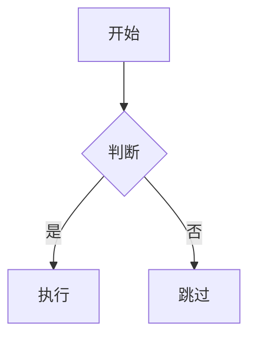

# VitePress 项目代码风格与修改规则 (Steering Rules)

> 本文档定义 AI Agent 在协作开发时必须遵守的强制性规则与约定。

---

## 1. 技术栈强制约束

### 1.1 包管理器规范

**强制要求：** 必须且仅使用 `pnpm` 作为包管理器

```bash
# ✅ 正确示例
pnpm install
pnpm add vitepress
pnpm run dev
pnpm run build

# ❌ 严禁使用
npm install        # 禁止
yarn add          # 禁止
npm run dev       # 禁止
```

**原因：**
- 项目通过 `preinstall` 脚本强制检查包管理器
- `pnpm-lock.yaml` 文件已存在，切换包管理器会导致依赖冲突
- `.npmrc` 配置了 pnpm 专用的镜像源

**验证方式：**
```json
// package.json
{
  "scripts": {
    "preinstall": "npx only-allow pnpm"
  }
}
```

### 1.2 Vue 组件语法规范

**强制要求：** 所有 Vue 组件必须采用 Vue 3 `<script setup lang="ts">` 组合式 API

```vue
<!-- ✅ 正确示例 -->
<script setup lang="ts">
import { ref, computed } from 'vue'

const count = ref(0)
const doubled = computed(() => count.value * 2)
</script>

<template>
  <div>{{ count }} × 2 = {{ doubled }}</div>
</template>

<style scoped>
/* 样式 */
</style>
```

```vue
<!-- ❌ 严禁使用 Options API -->
<script lang="ts">
export default {
  data() {
    return { count: 0 }
  },
  computed: {
    doubled() {
      return this.count * 2
    }
  }
}
</script>
```

**禁止行为：**
- 不得使用 Vue 2 选项式 API
- 不得混用组合式 API 和选项式 API
- 不得省略 TypeScript 类型标注

### 1.3 配置文件修改规范

**强制要求：** 修改导航和侧边栏时，仅修改指定配置文件

```typescript
// ✅ 正确：修改共享配置结构
// 文件：.vitepress/config/shared/nav.config.ts
export const navStructure: NavStructureItem[] = [
  { id: 'home', link: '/' },
  { id: 'guide', link: '/guide/getting-started' },
]

// ✅ 正确：修改语言翻译
// 文件：.vitepress/config/locales/zh/nav.ts
export const zhNavText: Record<string, string> = {
  'home': '首页',
  'guide': '指南',
}

// ❌ 错误：直接硬编码到 config.ts
export default defineConfig({
  themeConfig: {
    nav: [
      { text: '首页', link: '/' },  // 禁止硬编码
    ]
  }
})
```

**严禁破坏相对链接路径：**

```typescript
// ✅ 正确：使用相对路径
{
  id: 'guide',
  link: '/guide/getting-started'  // 相对路径
}

// ❌ 错误：使用绝对 URL
{
  id: 'guide',
  link: 'https://example.com/guide/getting-started'  // 破坏了路由
}
```

---

## 2. Agent 行为禁止事项 (Non-Negotiable)

### 2.1 禁止修改国际化文件结构

**规则：** `src/` 和 `src/en/` 和 `src/vi/` 的文件结构必须保持 1:1:1 对齐

```
src/
├── index.md                    # 中文首页
├── guide/
│   ├── getting-started.md      # 中文指南
│   └── configuration.md
├── en/
│   ├── index.md                # ✅ 英文首页（镜像）
│   └── guide/
│       ├── getting-started.md  # ✅ 英文指南（镜像）
│       └── configuration.md
└── vi/
    ├── index.md                # ✅ 越南语首页（镜像）
    └── guide/
        ├── getting-started.md  # ✅ 越南语指南（镜像）
        └── configuration.md
```

**操作要求：**

1. **添加新文件时：**
   ```bash
   # ✅ 正确流程
   # 1. 创建中文文档
   touch src/guide/new-feature.md
   
   # 2. 必须同步创建英文版本
   touch src/en/guide/new-feature.md
   
   # 3. 必须同步创建越南语版本
   touch src/vi/guide/new-feature.md
   ```

2. **删除文件时：**
   ```bash
   # ✅ 正确流程
   rm src/guide/old-feature.md
   rm src/en/guide/old-feature.md
   rm src/vi/guide/old-feature.md
   ```

3. **重命名文件时：**
   ```bash
   # ✅ 正确流程
   mv src/guide/old-name.md src/guide/new-name.md
   mv src/en/guide/old-name.md src/en/guide/new-name.md
   mv src/vi/guide/old-name.md src/vi/guide/new-name.md
   ```

**Agent 工作流程：**

```typescript
// Agent 内部检查逻辑（伪代码）
function onFileOperation(operation: 'add' | 'delete' | 'rename', filePath: string) {
  const locales = ['en', 'vi']
  
  // 检测是否为中文文档
  if (filePath.startsWith('src/') && !filePath.startsWith('src/en/') && !filePath.startsWith('src/vi/')) {
    // 自动同步到其他语言
    for (const locale of locales) {
      const mirrorPath = filePath.replace('src/', `src/${locale}/`)
      
      // 提示用户需要同步
      console.warn(`⚠️  检测到中文文档变更，请同步更新：${mirrorPath}`)
      
      // 询问是否自动创建空白模板
      if (operation === 'add') {
        const shouldCreate = confirm(`是否自动创建 ${mirrorPath}？`)
        if (shouldCreate) {
          createMirrorFile(mirrorPath, operation)
        }
      }
    }
  }
}
```

### 2.2 禁止硬编码敏感信息

**规则：** 禁止在 Markdown 或配置文件中写入任何敏感信息

```markdown
<!-- ❌ 禁止硬编码 -->
服务器地址：192.168.1.100
API Token：sk_live_xxxxxxxxxxxxx
数据库密码：MySecretPassword123

<!-- ✅ 正确做法 -->
服务器地址：通过环境变量 `VITE_API_URL` 配置
API Token：请参考 [认证文档](./authentication.md) 获取
数据库密码：请联系系统管理员获取
```

**环境变量使用规范：**

```typescript
// ✅ 正确：使用环境变量
const apiUrl = import.meta.env.VITE_API_URL
const apiKey = import.meta.env.VITE_API_KEY

// ❌ 错误：硬编码
const apiUrl = 'https://api.example.com'
const apiKey = 'sk_live_xxxxxxxxxxxxx'
```

**禁止列表：**
- ❌ 服务器 IP 地址
- ❌ 数据库连接字符串
- ❌ API 密钥 / Token
- ❌ 私钥文件内容
- ❌ 用户密码
- ❌ OAuth Client Secret
- ❌ AWS Access Key / Secret Key

### 2.3 禁止随意修改构建配置

**规则：** 未经允许不得改动 `package.json` 中的构建脚本

```json
// ✅ 允许修改：添加新的开发辅助脚本
{
  "scripts": {
    "dev": "vitepress dev",              // 核心脚本，不得修改
    "build": "vitepress build",          // 核心脚本，不得修改
    "preview": "vitepress preview",      // 核心脚本，不得修改
    "custom:analyze": "vite-bundle-visualizer"  // ✅ 可以添加
  }
}

// ❌ 禁止修改：改变核心构建命令
{
  "scripts": {
    "build": "vite build && custom-post-process"  // ❌ 禁止
  }
}
```

**需要审批的修改：**
- 修改 `dev`、`build`、`preview` 核心脚本
- 修改 `preinstall`、`prepare` 生命周期钩子
- 修改 `lint`、`typecheck` 质量检查脚本
- 添加可能影响构建产物的插件或配置

**无需审批的修改：**
- 添加新的辅助脚本（如 `format`、`analyze`）
- 修改开发依赖版本（需通过测试）
- 更新文档相关的依赖

---

## 3. 部署与环境约束

### 3.1 产物路径规范

**强制要求：** 打包输出路径统一为 `dist/`

```typescript
// ✅ 正确配置：.vitepress/config/site.ts
export const siteConfig = {
  srcDir: './src',      // 源码目录
  outDir: './dist',     // 构建产物目录（不得修改）
}

// ❌ 错误配置
export const siteConfig = {
  outDir: './build',    // 禁止修改为其他路径
  outDir: './docs',     // 禁止
  outDir: '../dist',    // 禁止
}
```

**原因：**
- CI/CD 工作流硬编码了 `dist/` 路径
- Docker 镜像构建依赖此路径
- `.gitignore` 配置了 `dist/` 忽略规则

### 3.2 环境变量使用规范

**开发环境 vs 生产环境：**

```env
# .env.development（开发环境）
VITE_BASE=/
VITE_SITE_URL=http://localhost:5173
VITE_ASSETS_BASE_URL=/assets/

# .env.production（生产环境）
VITE_BASE=/
VITE_SITE_URL=https://your-domain.com      # ⚠️ 需要用户配置
VITE_ASSETS_BASE_URL=https://cdn.example.com/assets/
```

**Agent 检查规则：**

```typescript
// 构建前验证
function validateProductionEnv() {
  const requiredVars = ['VITE_SITE_URL']
  const placeholders = ['your-domain.com', 'example.com', 'localhost']
  
  for (const varName of requiredVars) {
    const value = process.env[varName]
    
    if (!value) {
      throw new Error(`❌ 缺少必需的环境变量: ${varName}`)
    }
    
    if (placeholders.some(ph => value.includes(ph))) {
      console.warn(`⚠️  ${varName} 仍使用占位符值，请修改为实际域名`)
    }
  }
}
```

### 3.3 静态资源路径规范

**规则：** 所有静态资源必须放在 `public/` 目录

```
public/
├── favicon.ico           # ✅ 网站图标
├── logo.svg              # ✅ Logo 文件
├── og-image.png          # ✅ Open Graph 图片
└── assets/
    ├── images/           # ✅ 图片资源
    └── files/            # ✅ 下载文件
```

**Markdown 中引用静态资源：**

```markdown
<!-- ✅ 正确：使用相对路径 -->

[下载 PDF](/assets/files/guide.pdf)

<!-- ❌ 错误：使用绝对 URL -->


<!-- ❌ 错误：引用 src 目录外的文件 -->

```

---

## 4. Markdown 编写规范

### 4.1 文档结构规范

```markdown
---
title: 页面标题
description: 页面描述
---

# 主标题（H1，每页仅一个）

## 章节标题（H2）

### 小节标题（H3）

#### 子小节标题（H4）

正文内容...
```

**强制要求：**
- 每个 Markdown 文件必须有且仅有一个 H1 标题
- 标题层级不得跳级（H2 → H4 是禁止的）
- Frontmatter 必须包含 `title` 字段

### 4.2 Vue 组件嵌入规范

**允许的组件语法：**

```markdown
<!-- ✅ 正确：使用全局组件 -->
<Badge type="tip" text="推荐" />

<!-- ✅ 正确：使用局部导入 -->
<script setup>
import CustomComponent from './components/CustomComponent.vue'
</script>

<CustomComponent :data="myData" />

<!-- ❌ 错误：直接写 HTML 而不是 Vue 组件 -->
<div class="badge">推荐</div>
```

### 4.3 代码块规范

```markdown
<!-- ✅ 正确：指定语言高亮 -->
```typescript
const message: string = 'Hello'
```

<!-- ✅ 正确：高亮特定行 -->
```typescript{2,4-6}
const a = 1
const b = 2  // [!code highlight]
const c = 3
const d = 4  // [!code highlight]
const e = 5  // [!code highlight]
```

<!-- ❌ 错误：不指定语言 -->
```
const message = 'Hello'
```
```

---

## 5. Git 工作流规范

### 5.1 提交信息格式

**强制要求：** 遵循 Conventional Commits 规范

```bash
# ✅ 正确格式
feat(i18n): 添加日语翻译支持
fix(config): 修复导航链接路径错误
docs(readme): 更新部署文档
chore(deps): 升级 vitepress 到 2.0.0-alpha.21

# ❌ 错误格式
添加日语翻译           # 缺少类型前缀
fix 导航链接            # 缺少作用域和冒号
Update README.md        # 不符合规范
```

**类型列表：**
- `feat`: 新功能
- `fix`: Bug 修复
- `docs`: 文档变更
- `style`: 代码格式（不影响功能）
- `refactor`: 重构
- `perf`: 性能优化
- `test`: 测试相关
- `chore`: 构建/工具变更
- `ci`: CI/CD 配置

### 5.2 分支命名规范

```bash
# ✅ 正确
feature/add-japanese-i18n
fix/navigation-link-error
docs/update-deployment-guide
chore/upgrade-dependencies

# ❌ 错误
feature
fix-bug
my-branch
test
```

---

## 6. 性能优化规范

### 6.1 图片优化

**强制要求：**
- 图片必须压缩后再提交（推荐工具：TinyPNG、ImageOptim）
- 大图片（> 500KB）必须使用 WebP 格式
- 禁止提交未经优化的 PNG/JPG 原图

```markdown
<!-- ✅ 正确：使用优化后的 WebP -->


<!-- ❌ 错误：使用原始大图 -->
  <!-- 5MB -->
```

### 6.2 Mermaid 图表规范

**规则：** 复杂图表应该拆分为多个简单图表

```markdown
<!-- ✅ 正确：简洁的流程图 -->


<!-- ❌ 错误：过于复杂的图表（> 20 个节点） -->
```mermaid
graph TD
    A --> B --> C --> D --> E --> F --> ... <!-- 50+ 节点 -->
```
```

---

## 7. 安全规范

### 7.1 外部链接处理

```markdown
<!-- ✅ 正确：外部链接添加安全属性 -->
<a href="https://external-site.com" target="_blank" rel="noopener noreferrer">
  外部网站
</a>

<!-- ❌ 错误：缺少安全属性 -->
<a href="https://external-site.com" target="_blank">
  外部网站
</a>
```

### 7.2 XSS 防护

**规则：** 禁止在 Markdown 中直接嵌入不可信的 HTML

```markdown
<!-- ❌ 禁止：直接嵌入用户输入 -->
<div v-html="userInput"></div>

<!-- ✅ 正确：使用文本插值 -->
<div>{{ userInput }}</div>
```

---

## 8. Agent 检查清单

AI Agent 在执行任务前必须完成以下检查：

### 构建前检查
- [ ] 确认使用 `pnpm` 命令
- [ ] 确认 Vue 组件使用 `<script setup lang="ts">`
- [ ] 确认未硬编码敏感信息
- [ ] 确认环境变量配置正确

### 文件操作检查
- [ ] 确认国际化文件结构对齐
- [ ] 确认静态资源放在 `public/` 目录
- [ ] 确认图片已优化压缩
- [ ] 确认提交信息符合规范

### 配置修改检查
- [ ] 确认未修改核心构建脚本
- [ ] 确认输出目录为 `dist/`
- [ ] 确认未破坏相对链接路径
- [ ] 确认配置变更已同步到所有语言

---

## 9. 常见错误与修正

### 错误 1：使用 npm 命令

```bash
# ❌ 错误
$ npm install

# ✅ 修正
$ pnpm install
```

### 错误 2：国际化文件不同步

```bash
# ❌ 错误：只创建中文文档
$ echo "# 新功能" > src/guide/new-feature.md

# ✅ 修正：同步创建所有语言版本
$ echo "# 新功能" > src/guide/new-feature.md
$ echo "# New Feature" > src/en/guide/new-feature.md
$ echo "# Tính năng mới" > src/vi/guide/new-feature.md
```

### 错误 3：硬编码配置

```typescript
// ❌ 错误
const apiUrl = 'https://api.example.com'

// ✅ 修正
const apiUrl = import.meta.env.VITE_API_URL || 'https://api.example.com'
```

---

## 10. 异常处理

当 Agent 检测到违反规则的操作时，应该：

1. **阻止操作：** 拒绝执行违规命令
2. **提示原因：** 清晰说明违反了哪条规则
3. **提供修正方案：** 给出符合规范的正确做法
4. **记录日志：** 将违规尝试记录到日志文件

```typescript
// Agent 异常处理逻辑示例
function handleRuleViolation(rule: string, action: string) {
  console.error(`❌ 违反规则：${rule}`)
  console.error(`尝试的操作：${action}`)
  console.info(`✅ 正确做法：${getRuleSuggestion(rule)}`)
  
  // 阻止执行
  throw new Error(`操作被拒绝：违反 ${rule}`)
}
```

---

**规范版本：** 2.0.0  
**最后更新：** 2024-10-03  
**维护者：** VitePress 项目团队  
**适用范围：** 所有 AI Agent（Claude、GPT、Copilot 等）
