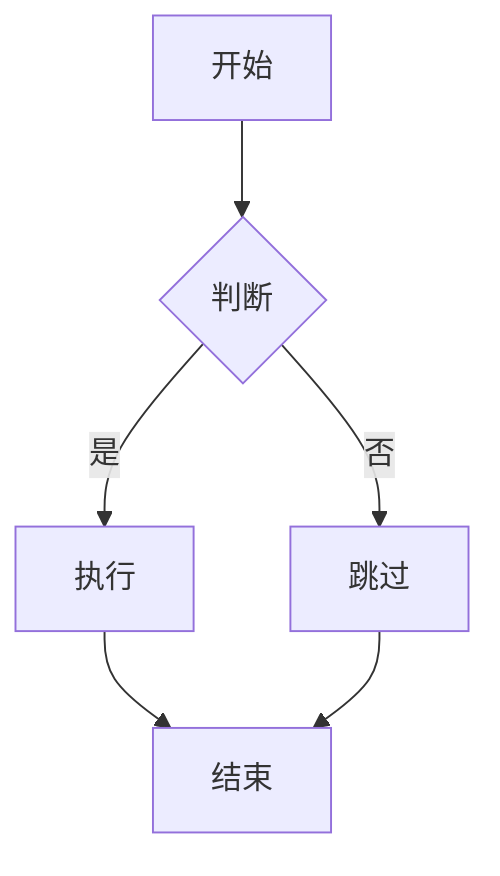

# AGENTS.md - AI 协作开发指南

> 本文档为 AI 开发助手（如 GitHub Copilot、Cursor、Claude、ChatGPT 等）提供项目架构、规范与开发约束，确保 AI 生成的代码符合项目标准。

---

## 📚 目录

- [1. 项目概览](#1-项目概览)
- [2. 技术栈](#2-技术栈)
- [3. 目录结构](#3-目录结构)
- [4. 开发规范](#4-开发规范)
- [5. 配置架构](#5-配置架构)
- [6. 常用命令](#6-常用命令)
- [7. Markdown 撰写规范](#7-markdown-撰写规范)
- [8. 部署流程](#8-部署流程)
- [9. AI Agent 协作规则](#9-ai-agent-协作规则)

---

## 1. 项目概览

### 1.1 项目定位
基于 VitePress 构建的多语言文档站点，支持中文、英文、越南语三种语言。

### 1.2 架构特点
- ✅ **模块化配置**：结构与翻译完全分离
- ✅ **类型安全**：完整的 TypeScript 类型定义
- ✅ **配置验证**：开发环境自动验证配置完整性
- ✅ **多平台部署**：支持 GitHub Pages、Vercel、Cloudflare Pages、Docker

### 1.3 关键约束
⚠️ **严禁改动已完工配置：**
- 国际化配置（`.vitepress/config/locales/`）
- 图表组件（Mermaid 配置）
- Git Hooks（Husky）
- 环境变量配置（`.env.*` 文件）
- Docker 基础配置

---

## 2. 技术栈

### 2.1 核心框架
```json
{
  "runtime": "Node.js >= 18.0.0",
  "packageManager": "pnpm >= 11.22.0",
  "framework": "VitePress 2.0.0-alpha.20",
  "language": "TypeScript 5.7.3",
  "buildTool": "Vite 8.3.2"
}
```

### 2.2 开发工具
```json
{
  "linter": "ESLint 10.11.0 (@antfu/eslint-config)",
  "formatter": "ESLint (自动修复)",
  "typeChecker": "vue-tsc 3.3.11",
  "gitHooks": "Husky 9.1.7 + lint-staged 17.5.1",
  "commitLint": "@commitlint/cli 21.2.3 (conventional)"
}
```

### 2.3 部署平台
- **GitHub Pages** - 静态站点托管
- **Vercel** - 边缘部署
- **Cloudflare Pages** - CDN 加速
- **Docker** - 容器化部署（Nginx）
- **腾讯云/阿里云** - 镜像仓库

---

## 3. 目录结构

```
01-docs/
├── .github/
│   └── workflows/              # GitHub Actions 工作流
│       ├── ci.yml             # 代码质量检查
│       ├── deploy.yml         # 🆕 多平台部署
│       ├── docker-cloud.yml   # 🆕 Docker 镜像构建
│       ├── deploy-gh-pages.yml
│       ├── deploy-aliyun-oss.yml
│       ├── deploy-tencent-cos.yml
│       └── release.yml
│
├── .husky/                     # Git Hooks 配置
│   ├── commit-msg             # Commit 信息校验
│   └── pre-commit             # 代码提交前检查
│
├── .vitepress/                 # VitePress 配置目录
│   ├── cache/                 # 构建缓存（.gitignore）
│   ├── config/                # 配置模块化目录
│   │   ├── locales/          # 🔒 国际化翻译（禁止改动）
│   │   │   ├── zh/           # 中文翻译
│   │   │   ├── en/           # 英文翻译
│   │   │   └── vi/           # 越南语翻译
│   │   ├── shared/           # 共享配置结构
│   │   │   ├── nav.config.ts      # 导航结构
│   │   │   ├── sidebar.config.ts  # 侧边栏结构
│   │   │   ├── search.config.ts   # 搜索引擎配置
│   │   │   └── theme.config.ts    # 主题共享配置
│   │   ├── utils/            # 配置工具函数
│   │   │   ├── merge-config.ts    # 配置合并工具
│   │   │   ├── validators.ts      # 配置验证工具
│   │   │   └── env-validator.ts   # 环境变量验证
│   │   ├── i18n.ts           # 国际化基础配置
│   │   ├── site.ts           # 站点技术配置
│   │   ├── seo.ts            # SEO 配置
│   │   ├── markdown.ts       # 🔒 Markdown 配置（禁止改动）
│   │   ├── OPTIMIZATION.md   # 优化说明文档
│   │   └── CHANGES.md        # 变更日志
│   ├── theme/                # 主题定制
│   │   └── index.ts          # 🔒 主题入口（含 Mermaid）
│   └── config.ts             # 主配置入口
│
├── public/                     # 静态资源目录
│   ├── favicon.ico
│   ├── logo.svg
│   └── og-image.png
│
├── src/                        # Markdown 文档源文件
│   ├── index.md               # 首页
│   ├── markdown-examples.md
│   ├── api-examples.md
│   ├── mermaid-examples.md
│   ├── en/                    # 英文文档
│   └── vi/                    # 越南语文档
│
├── tests/                      # 🆕 单元测试目录
│   ├── config.test.ts
│   └── validators.test.ts
│
├── .dockerignore              # 🆕 Docker 构建忽略
├── .editorconfig              # 编辑器配置
├── .env.development           # 🔒 开发环境变量（禁止改动）
├── .env.production            # 🔒 生产环境变量（禁止改动）
├── .env.example               # 环境变量示例
├── .gitattributes
├── .gitignore
├── .npmrc                     # npm 配置（pnpm）
├── .nvmrc                     # Node 版本锁定
├── Dockerfile                 # 🆕 Docker 镜像构建
├── vercel.json                # 🆕 Vercel 部署配置
├── package.json
├── pnpm-lock.yaml
├── tsconfig.json
├── vitest.config.ts           # 🆕 测试配置
├── AGENTS.md                  # 🆕 AI 协作指南（本文档）
└── README.md                  # 🆕 项目说明文档
```

---

## 4. 开发规范

### 4.1 代码风格

#### TypeScript 规范
```typescript
// ✅ 推荐：使用 export const 导出配置
export const navConfig = { /* ... */ }

// ❌ 避免：使用 export default
export default { /* ... */ }

// ✅ 推荐：明确的类型注解
export function mergeConfig(data: ConfigType): ResultType { /* ... */ }

// ❌ 避免：隐式 any 类型
export function mergeConfig(data) { /* ... */ }

// ✅ 推荐：使用接口定义类型
interface NavItem {
  id: string
  link?: string
  external?: boolean
}

// ✅ 推荐：使用 Record 类型表示键值对
type Translations = Record<string, string>
```

#### 命名规范
```typescript
// 文件名：kebab-case
// nav.config.ts, merge-config.ts, env-validator.ts

// 变量/函数：camelCase
const navStructure = []
function mergeConfig() {}

// 类型/接口：PascalCase
interface NavStructureItem {}
type ConfigType = {}

// 常量：UPPER_SNAKE_CASE
const VITE_BASE = '/'
const DEFAULT_LOCALE = 'zh'
```

#### 注释规范
```typescript
/**
 * 合并导航配置
 * 
 * 将共享的导航结构与语言翻译合并为 VitePress 所需的最终配置
 * 
 * @param structure - 导航结构（来自 shared/nav.config.ts）
 * @param texts - 导航文本翻译（来自 locales/xx/nav.ts）
 * @param locale - 语言代码（'' 表示根路径，'en' 表示 /en/）
 * @returns VitePress 导航配置
 * 
 * @example
 * ```ts
 * const nav = mergeNav(navStructure, zhNavText, '')
 * ```
 */
export function mergeNav(
  structure: NavStructureItem[],
  texts: Record<string, string>,
  locale: string = ''
): DefaultTheme.NavItem[] {
  // 实现...
}
```

### 4.2 Git 提交规范

遵循 [Conventional Commits](https://www.conventionalcommits.org/) 规范：

```bash
# 提交格式
<type>(<scope>): <subject>

# 类型（type）
feat:     新功能
fix:      Bug 修复
docs:     文档变更
style:    代码格式（不影响功能）
refactor: 重构（既不是新功能也不是修复）
perf:     性能优化
test:     添加/修改测试
chore:    构建/工具/依赖变更
ci:       CI/CD 配置变更

# 示例
feat(i18n): 添加日语翻译支持
fix(config): 修复导航链接前缀错误
docs(readme): 更新部署说明
ci(github): 添加多平台部署工作流
```

### 4.3 代码审查要点

在提交 PR 或让 AI 生成代码前，确保：
- ✅ TypeScript 类型检查通过（`pnpm run typecheck`）
- ✅ ESLint 检查通过（`pnpm run lint`）
- ✅ 所有测试通过（`pnpm run test`）
- ✅ 配置验证通过（启动开发服务器时自动执行）
- ✅ 没有改动 `locales/`、`.env.*`、Husky 等已完工配置

---

## 5. 配置架构

### 5.1 架构原则

#### 核心原则：结构与翻译分离
```typescript
// ❌ 错误：结构和翻译混在一起
const nav = [
  { text: '首页', link: '/' },
  { text: 'Home', link: '/en/' }
]

// ✅ 正确：结构和翻译分离
// shared/nav.config.ts
export const navStructure = [
  { id: 'home', link: '/' }
]

// locales/zh/nav.ts
export const zhNavText = {
  'home': '首页'
}

// locales/en/nav.ts
export const enNavText = {
  'home': 'Home'
}
```

### 5.2 配置文件职责

| 文件 | 职责 | 可修改 |
|------|------|--------|
| `shared/nav.config.ts` | 导航结构（路由、层级） | ✅ |
| `shared/sidebar.config.ts` | 侧边栏结构 | ✅ |
| `shared/search.config.ts` | 搜索引擎技术参数 | ✅ |
| `shared/theme.config.ts` | 主题共享配置 | ✅ |
| `locales/zh/nav.ts` | 中文导航翻译 | ❌ |
| `locales/zh/sidebar.ts` | 中文侧边栏翻译 | ❌ |
| `locales/zh/search.ts` | 中文搜索翻译 | ❌ |
| `locales/zh/ui.ts` | 中文 UI 翻译 | ❌ |
| `locales/zh/meta.ts` | 中文元数据 | ❌ |
| `utils/merge-config.ts` | 配置合并工具 | ✅ |
| `utils/validators.ts` | 配置验证工具 | ✅ |
| `utils/env-validator.ts` | 环境变量验证 | ✅ |

### 5.3 配置验证机制

开发环境启动时会自动验证：
```
🔍 开始验证 [zh] 语言配置...
✅ [zh] 导航翻译验证通过 (5 个键)
✅ [zh] 侧边栏翻译验证通过 (4 个键)
✅ [zh] 搜索翻译验证通过
✅ [zh] UI 翻译验证通过
✅ [zh] 元数据验证通过
✅ [zh] 所有配置验证通过
```

---

## 6. 常用命令

### 6.1 包管理

```bash
# ⚠️ 必须使用 pnpm（强制要求）
pnpm install           # 安装依赖
pnpm add <package>     # 添加依赖
pnpm add -D <package>  # 添加开发依赖
pnpm remove <package>  # 移除依赖
pnpm update            # 更新依赖

# ❌ 禁止使用 npm 或 yarn
# 项目有 .npmrc 和 preinstall 脚本强制使用 pnpm
```

### 6.2 开发命令

```bash
# 开发服务器（热更新 + 配置验证）
pnpm run dev
# 访问: http://localhost:5173

# 类型检查
pnpm run typecheck

# 代码检查
pnpm run lint

# 代码修复
pnpm run lint:fix

# 运行测试
pnpm run test

# 测试覆盖率
pnpm run test:coverage

# 测试观察模式
pnpm run test:watch
```

### 6.3 构建命令

```bash
# 生产构建
pnpm run build
# 输出目录: dist/

# 预览构建产物
pnpm run preview
# 访问: http://localhost:4173
```

### 6.4 Git 命令

```bash
# 提交代码（会触发 Husky 钩子）
git add .
git commit -m "feat: 添加新功能"
# 自动执行: lint-staged + commitlint

# 提交前手动检查
pnpm run lint
pnpm run typecheck
```

---

## 7. Markdown 撰写规范

### 7.1 Frontmatter 配置

```yaml
---
# 页面标题（覆盖 h1，影响 SEO）
title: 页面标题

# 页面描述（SEO meta description）
description: 页面描述文本

# 页面布局类型
layout: doc        # 文档页（默认，带侧边栏）
# layout: home     # 首页布局
# layout: page     # 自定义页面（无侧边栏）

# 是否显示大纲（目录）
outline: deep      # 显示 h2-h6
# outline: [2, 3]  # 只显示 h2-h3
# outline: false   # 不显示

# 页面编辑链接
editLink: true     # 显示"编辑此页"链接
# editLink: false  # 不显示

# 最后更新时间
lastUpdated: true  # 显示最后更新时间
# lastUpdated: false

# 上一页/下一页导航
prev:
  text: '上一页标题'
  link: '/path/to/prev'
next:
  text: '下一页标题'
  link: '/path/to/next'

# 自定义侧边栏（当前页）
sidebar: false     # 不显示侧边栏

# 页面级别的 <head> 标签
head:
  - - meta
    - name: keywords
      content: 关键词1, 关键词2
---
```

### 7.2 Markdown 语法示例

#### 标题层级
```markdown
# H1 标题（每个页面只有一个）

## H2 标题

### H3 标题

#### H4 标题
```

#### 代码块
````markdown
```typescript
// 指定语言以启用语法高亮
const message: string = 'Hello World'
console.log(message)
```

```typescript{1,3-5}
// 高亮特定行
const a = 1  // [!code highlight]
const b = 2
const c = 3  // [!code highlight]
const d = 4  // [!code highlight]
```

```typescript
// 添加/删除标记
const old = 'old value'  // [!code --]
const new = 'new value'  // [!code ++]
```
````

#### 自定义容器
```markdown
::: info 信息
这是一个信息容器
:::

::: tip 提示
这是一个提示容器
:::

::: warning 警告
这是一个警告容器
:::

::: danger 危险
这是一个危险警告容器
:::

::: details 点击展开
这是一个可折叠的详情容器
:::
```

#### Mermaid 图表
````markdown

````

#### 表格
```markdown
| 左对齐 | 居中对齐 | 右对齐 |
|:-------|:--------:|-------:|
| 内容1  |  内容2   |  内容3 |
```

#### 链接
```markdown
<!-- 内部链接（自动添加语言前缀） -->
[链接文本](/path/to/page)

<!-- 外部链接 -->
[GitHub](https://github.com)

<!-- 带标题的链接 -->
[链接文本](/path "悬停标题")
```

### 7.3 多语言文档组织

```
src/
├── index.md              # 中文首页
├── guide.md              # 中文指南
├── api.md                # 中文 API
├── en/                   # 英文文档
│   ├── index.md         # 英文首页
│   ├── guide.md         # 英文指南
│   └── api.md           # 英文 API
└── vi/                   # 越南语文档
    ├── index.md
    ├── guide.md
    └── api.md
```

**命名规则：**
- ✅ 使用小写 + 短横线：`getting-started.md`
- ❌ 避免驼峰命名：`gettingStarted.md`
- ✅ 语义化命名：`api-reference.md`
- ❌ 避免拼音：`zhidao.md`

---

## 8. 部署流程

### 8.1 环境变量配置

#### 开发环境（`.env.development`）
```env
VITE_BASE=/
VITE_SITE_URL=http://localhost:5173
```

#### 生产环境（`.env.production`）
```env
VITE_BASE=/
VITE_SITE_URL=https://your-domain.com
```

### 8.2 部署平台配置

#### GitHub Pages
- 触发：推送到 `main` 分支
- 工作流：`.github/workflows/deploy-gh-pages.yml`
- 访问地址：`https://username.github.io/repo-name/`

#### Vercel
- 配置文件：`vercel.json`
- 自动部署：推送到 `main` 分支
- 访问地址：Vercel 提供的域名

#### Cloudflare Pages
- 触发：推送到 `main` 分支
- 构建命令：`pnpm run build`
- 输出目录：`dist`

#### Docker
- Dockerfile：轻量化多阶段构建
- 基础镜像：`node:18-alpine`（构建）+ `nginx:alpine`（运行）
- 镜像推送：腾讯云/阿里云容器镜像服务

### 8.3 部署检查清单

部署前确保：
- ✅ 环境变量正确配置
- ✅ `VITE_SITE_URL` 为生产域名
- ✅ TypeScript 类型检查通过
- ✅ 所有测试通过
- ✅ 构建成功无错误

---

## 9. AI Agent 协作规则

### 9.1 核心约束

#### 🚫 严禁操作（CRITICAL）
1. **国际化配置禁止修改**
   - `.vitepress/config/locales/` 下所有文件
   - 已完成中英越三语翻译，禁止任何改动

2. **环境变量禁止修改**
   - `.env.development`
   - `.env.production`
   - `.env.example`（可添加新变量说明）

3. **Git Hooks 禁止修改**
   - `.husky/` 目录
   - `lint-staged` 配置

4. **图表组件禁止修改**
   - `.vitepress/theme/index.ts` 中的 Mermaid 配置
   - `.vitepress/config/markdown.ts`

5. **已完工的工作流禁止修改**
   - `.github/workflows/ci.yml`
   - `.github/workflows/deploy-gh-pages.yml`
   - `.github/workflows/deploy-aliyun-oss.yml`
   - `.github/workflows/deploy-tencent-cos.yml`
   - `.github/workflows/release.yml`

### 9.2 推荐操作

#### ✅ 可以新增
1. **新的工作流文件**
   - `.github/workflows/deploy.yml`（多平台部署）
   - `.github/workflows/docker-cloud.yml`（Docker 镜像）

2. **新的配置文件**
   - `vercel.json`
   - `Dockerfile`
   - `.dockerignore`
   - `vitest.config.ts`

3. **新的文档文件**
   - `AGENTS.md`（本文档）
   - `README.md`（更新）

4. **新的测试文件**
   - `tests/*.test.ts`

#### ✅ 可以修改
1. **共享配置结构**
   - `.vitepress/config/shared/` 下的文件
   - 修改时确保不破坏现有翻译的 key 映射

2. **工具函数**
   - `.vitepress/config/utils/` 下的文件
   - 修改时确保向后兼容

3. **主配置文件**
   - `.vitepress/config.ts`
   - 仅在必要时修改，确保不破坏现有逻辑

### 9.3 代码生成指南

#### 生成新配置时
```typescript
// ✅ 推荐：保持与现有架构一致
// 1. 定义结构
export interface NewStructure {
  id: string
  // ...其他字段
}

// 2. 导出配置
export const newStructure: NewStructure[] = [
  { id: 'item1' },
  { id: 'item2' }
]

// 3. 在翻译文件中添加对应的 key
// locales/zh/new.ts
export const zhNewText: Record<string, string> = {
  'item1': '项目1',
  'item2': '项目2'
}
```

#### 生成新验证器时
```typescript
// ✅ 推荐：参考现有验证器模式
export function validateNewConfig(
  data: any,
  locale: string
): void {
  const missingKeys: string[] = []
  
  // 验证逻辑...
  
  if (missingKeys.length > 0) {
    throw new Error(
      `[${locale}] 配置错误：\n${missingKeys.join('\n')}`
    )
  }
  
  console.log(`✅ [${locale}] 验证通过`)
}
```

#### 生成新的工作流时
```yaml
# ✅ 推荐：遵循现有工作流模式
name: Workflow Name

on:
  push:
    branches: [main]

jobs:
  build:
    runs-on: ubuntu-latest
    steps:
      - uses: actions/checkout@v4
      
      - uses: pnpm/action-setup@v4
        with:
          version: 11
      
      - uses: actions/setup-node@v4
        with:
          node-version: 18
          cache: 'pnpm'
      
      - run: pnpm install --frozen-lockfile
      - run: pnpm run build
```

### 9.4 错误处理指南

#### 遇到类型错误
1. 先运行 `pnpm run typecheck` 确认错误
2. 检查是否有缺失的类型定义
3. 优先修复类型声明，避免使用 `any`

#### 遇到配置验证失败
1. 查看控制台输出的详细错误信息
2. 检查是否缺少翻译 key
3. 确保结构配置的 id 与翻译 key 一致

#### 遇到构建失败
1. 检查环境变量是否正确配置
2. 确保所有依赖已安装（`pnpm install`）
3. 查看构建日志定位具体错误

### 9.5 AI 提示词模板

#### 添加新配置
```
请在 .vitepress/config/shared/ 下添加新的配置文件，
遵循现有的架构模式：
1. 定义 TypeScript 接口
2. 导出配置数组
3. 使用 id 字段关联翻译
4. 添加详细的 JSDoc 注释

注意：不要修改 locales/ 目录下的任何文件
```

#### 添加新功能
```
请为项目添加 [功能名称]，要求：
1. 遵循现有的代码风格（@antfu/eslint-config）
2. 使用 TypeScript 严格模式
3. 添加必要的类型定义
4. 编写单元测试
5. 更新相关文档

严禁修改：
- .vitepress/config/locales/
- .env.* 文件
- .husky/ 目录
```

#### 修复问题
```
项目遇到以下问题：[问题描述]

请提供解决方案，要求：
1. 不破坏现有功能
2. 保持向后兼容
3. 遵循项目规范
4. 添加必要的测试

可以修改：
- .vitepress/config/shared/
- .vitepress/config/utils/
- tests/

禁止修改：
- .vitepress/config/locales/
- 已完工的工作流文件
```

---

## 📚 相关资源

### 官方文档
- [VitePress 官方文档](https://vitepress.dev/)
- [Vite 官方文档](https://vitejs.dev/)
- [TypeScript 官方文档](https://www.typescriptlang.org/)

### 内部文档
- [配置优化说明](./vitepress/config/OPTIMIZATION.md)
- [变更日志](./vitepress/config/CHANGES.md)
- [国际化架构说明](./vitepress/config/locales/README.md)

### 工具文档
- [pnpm 官方文档](https://pnpm.io/)
- [Husky 官方文档](https://typicode.github.io/husky/)
- [Conventional Commits](https://www.conventionalcommits.org/)

---

## 📞 联系方式

如有疑问或需要协助，请：
1. 查阅本文档
2. 阅读内部文档（`.vitepress/config/*.md`）
3. 查看现有代码示例
4. 提交 Issue

**最后更新：** 2024-10-03  
**文档版本：** 1.0.0  
**维护者：** 项目团队
