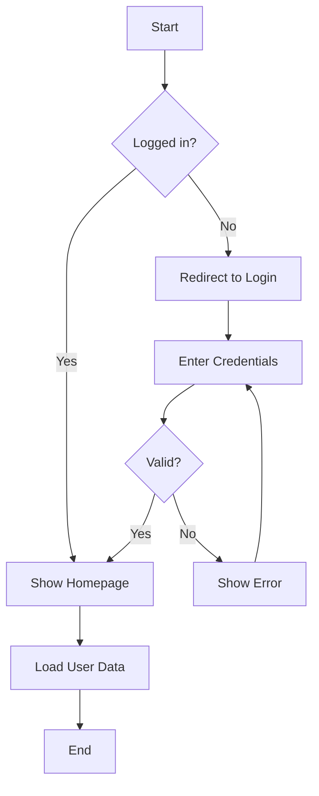
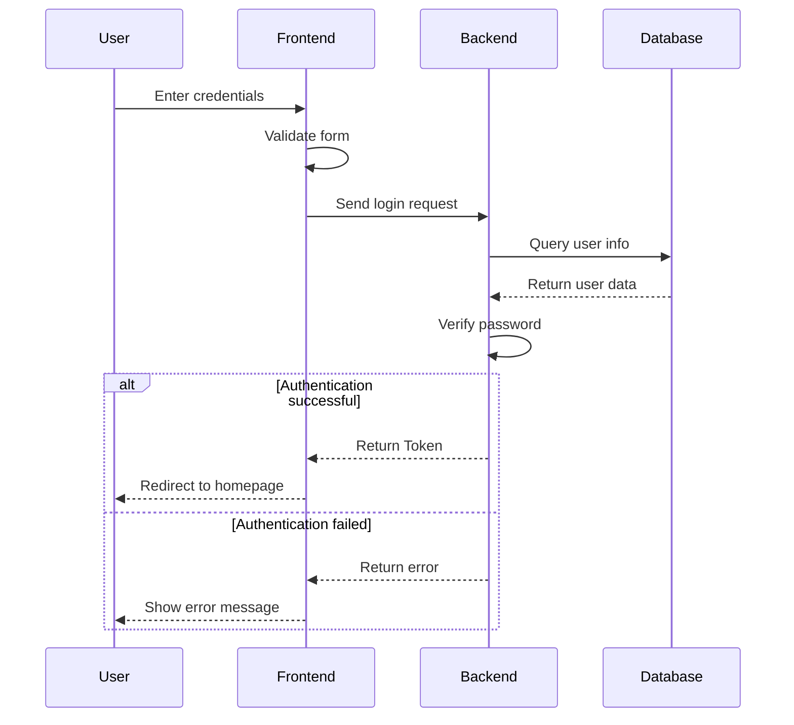
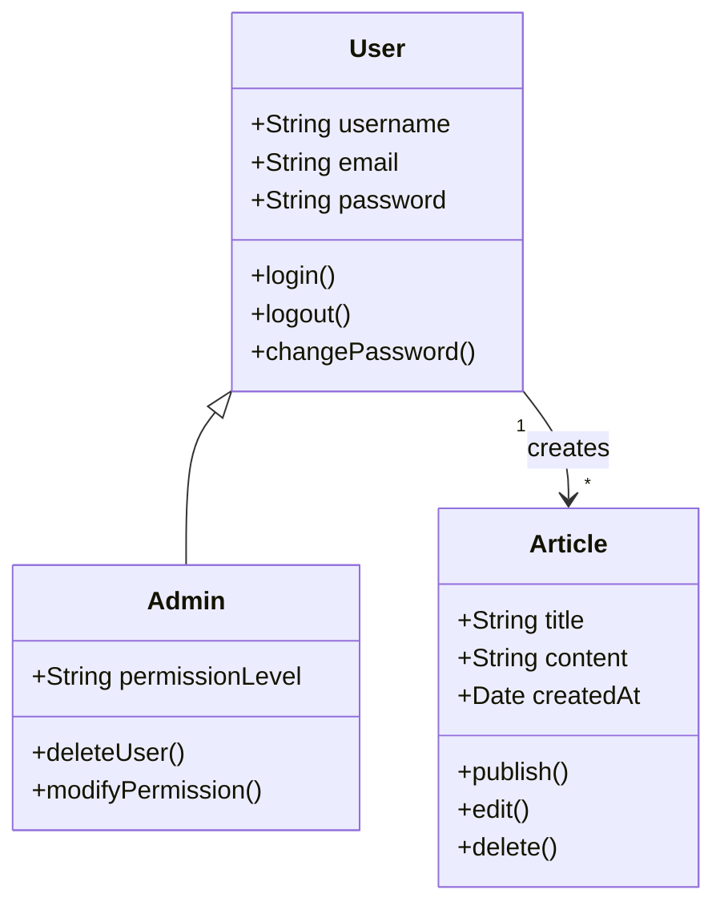
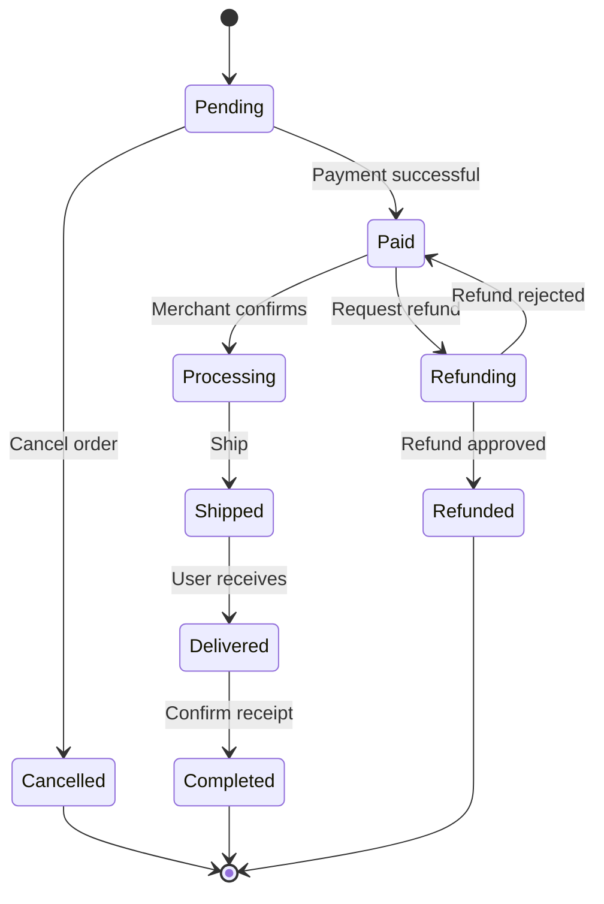
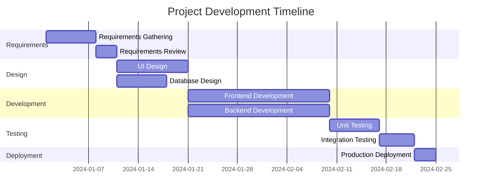
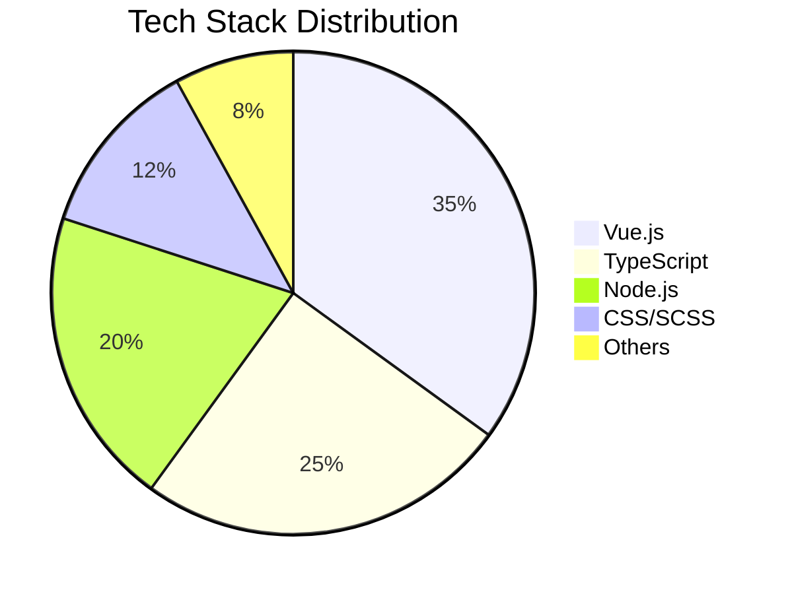
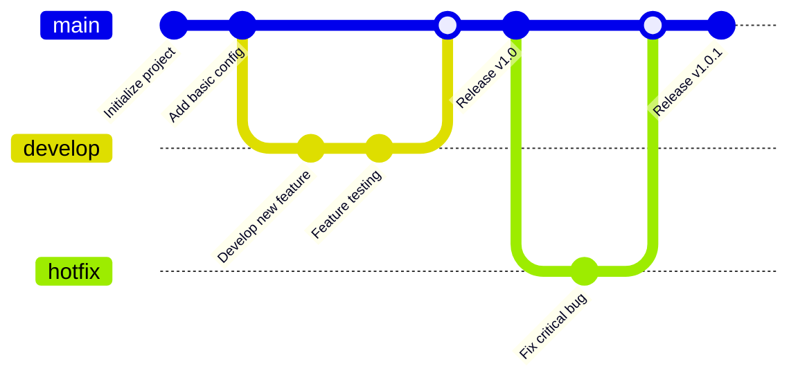
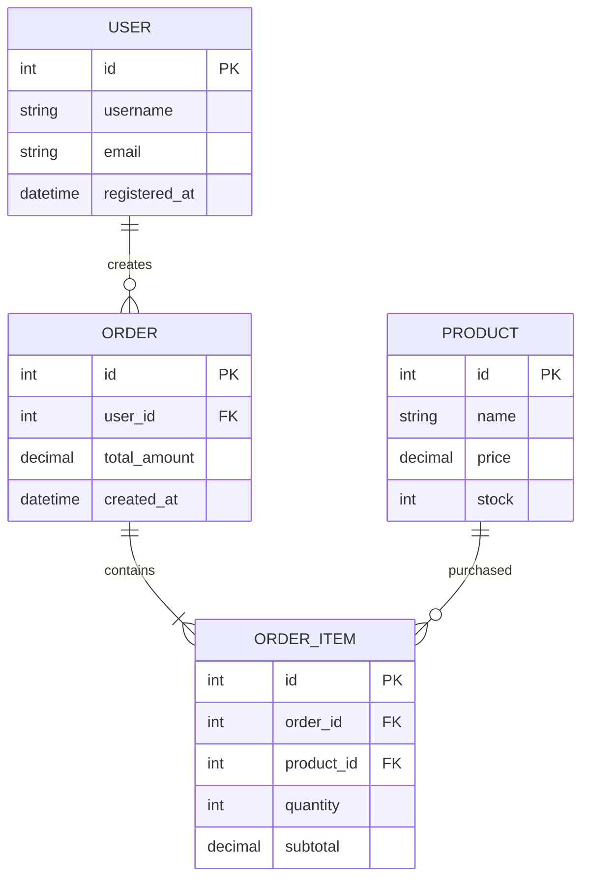
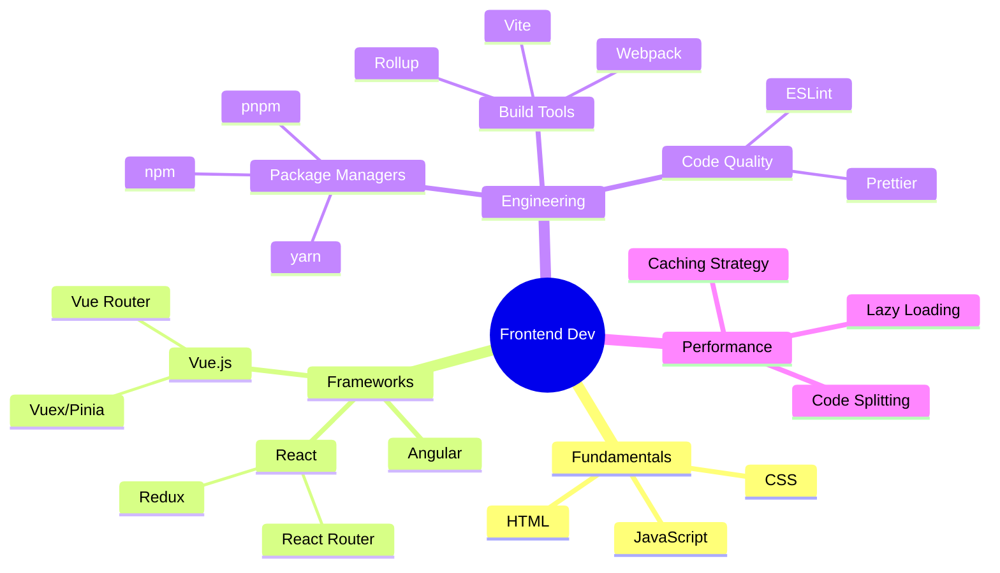

# Mermaid Diagram Examples

This page demonstrates how to use Mermaid to create various types of diagrams in VitePress.

## What is Mermaid?

Mermaid is a JavaScript-based diagramming tool that uses Markdown-inspired syntax to create and modify diagrams. With simple text descriptions, you can quickly create flowcharts, sequence diagrams, Gantt charts, and more.

## How to Use

Create Mermaid diagrams using ` ```mermaid ` code blocks in your Markdown documents:

## Flowchart

Flowcharts are used to show the steps and decision points in a process or system.

**Example:**



## Sequence Diagram

Sequence diagrams show the interaction order between objects.

**Example: User Login Flow**



## Class Diagram

Class diagrams show the structure of classes and relationships between them.

**Example:**



## State Diagram

State diagrams show the different states of an object during its lifecycle.

**Example: Order Status Flow**



## Gantt Chart

Gantt charts are used for project management to show project progress and task scheduling.

**Example: Project Development Plan**



## Pie Chart

Pie charts show the proportion of data.

**Example: Tech Stack Distribution**



## Git Graph

Git graphs show Git branches and commit history.

**Example:**



## Entity Relationship Diagram

ER diagrams show the relationships between entities in a database.

**Example:**



## Mindmap

Mindmaps show hierarchical relationships between ideas and concepts.

**Example: Frontend Learning Path**



## More Resources

- [Mermaid Official Documentation](https://mermaid.js.org/)
- [Mermaid Live Editor](https://mermaid.live/)
- [Syntax Reference](https://mermaid.js.org/intro/syntax-reference.html)
