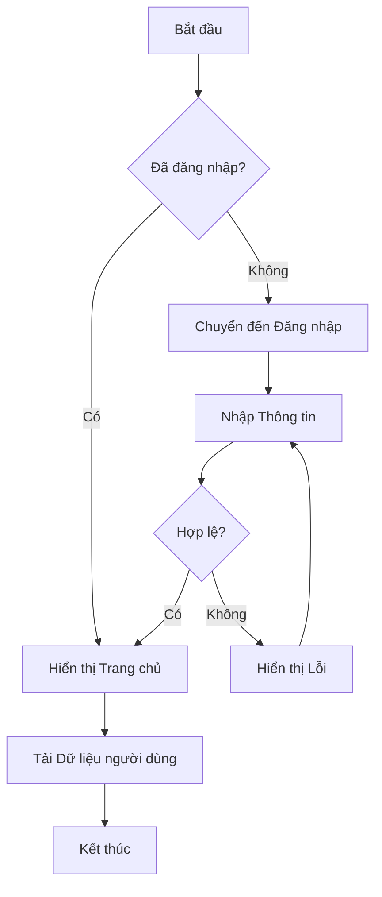
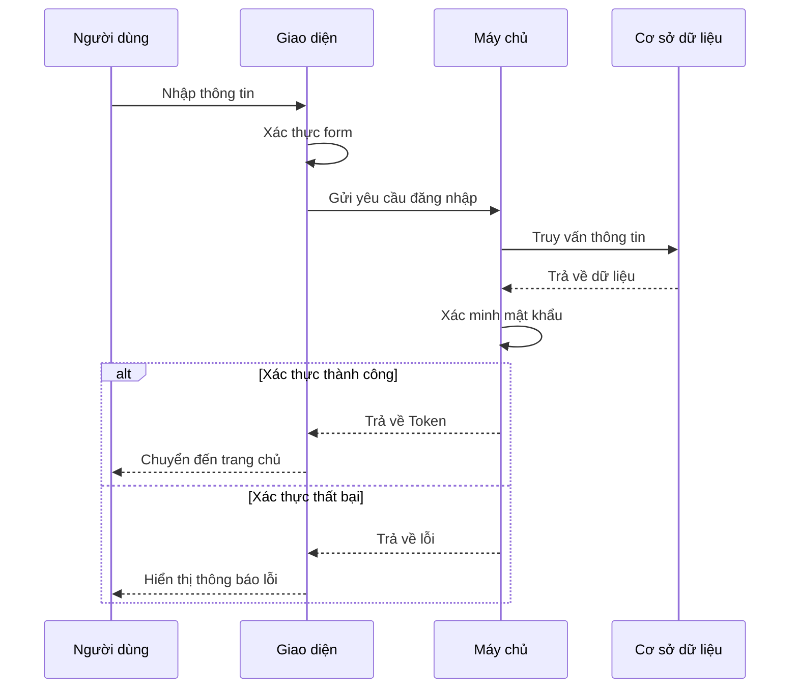
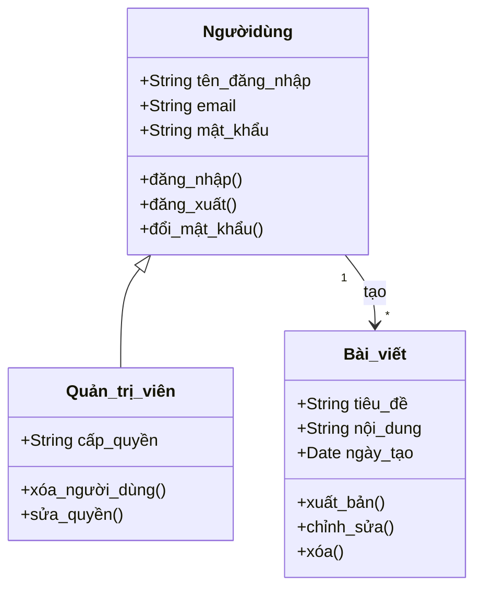
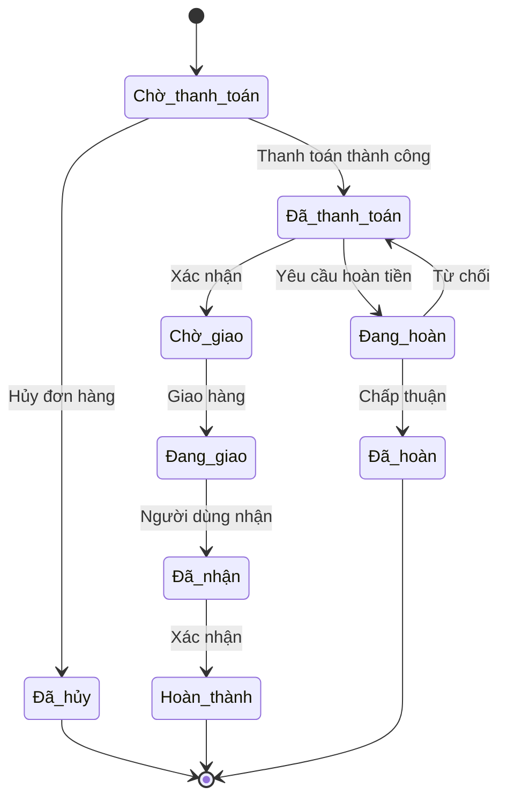
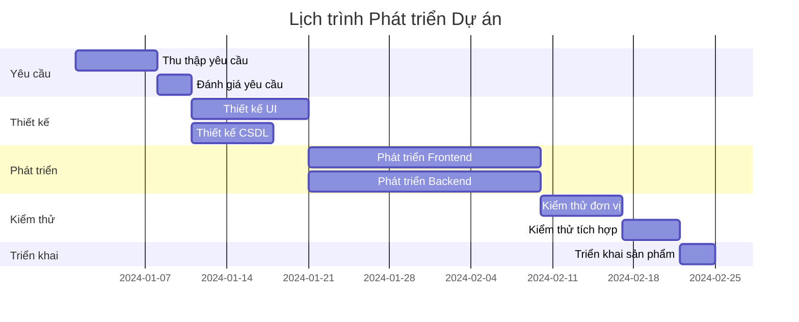
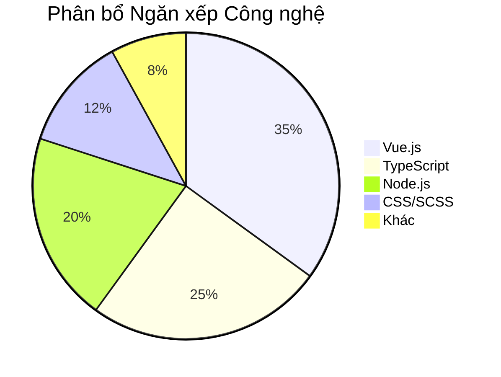
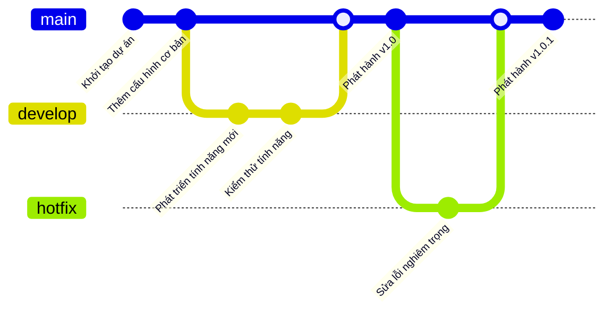
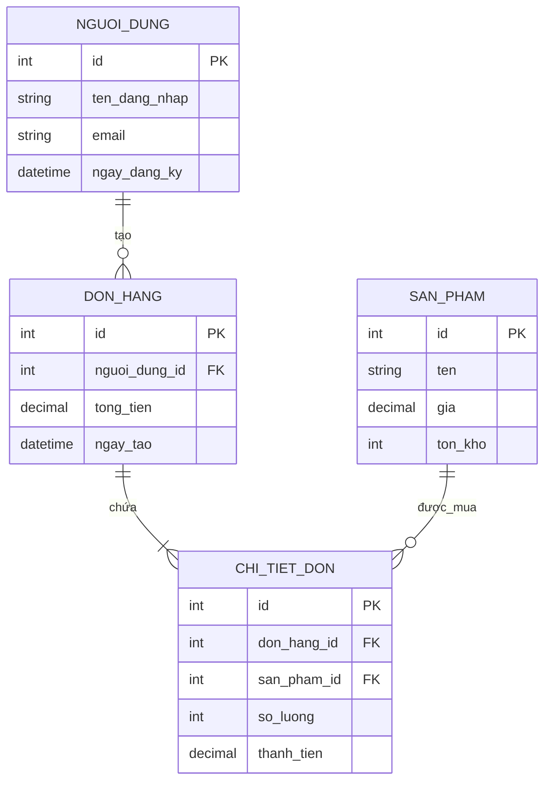
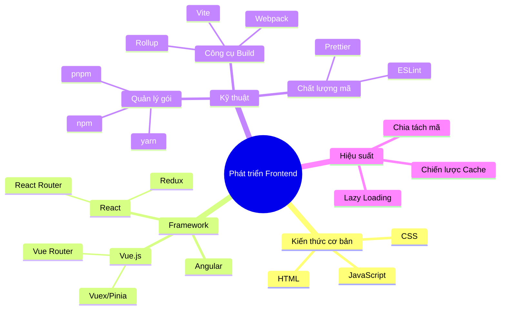

# Ví dụ Sơ đồ Mermaid

Trang này trình bày cách sử dụng Mermaid để tạo các loại sơ đồ khác nhau trong VitePress.

## Mermaid là gì?

Mermaid là một công cụ vẽ sơ đồ dựa trên JavaScript, sử dụng cú pháp lấy cảm hứng từ Markdown để tạo và chỉnh sửa sơ đồ. Với mô tả văn bản đơn giản, bạn có thể nhanh chóng tạo sơ đồ luồng, sơ đồ trình tự, biểu đồ Gantt và nhiều hơn nữa.

## Cách sử dụng

Tạo sơ đồ Mermaid bằng cách sử dụng khối mã ` ```mermaid ` trong tài liệu Markdown của bạn:

## Sơ đồ Luồng (Flowchart)

Sơ đồ luồng được sử dụng để hiển thị các bước và điểm quyết định trong một quy trình hoặc hệ thống.

**Ví dụ:**



## Sơ đồ Trình tự (Sequence Diagram)

Sơ đồ trình tự hiển thị thứ tự tương tác giữa các đối tượng.

**Ví dụ: Luồng Đăng nhập Người dùng**



## Sơ đồ Lớp (Class Diagram)

Sơ đồ lớp hiển thị cấu trúc các lớp và mối quan hệ giữa chúng.

**Ví dụ:**



## Sơ đồ Trạng thái (State Diagram)

Sơ đồ trạng thái hiển thị các trạng thái khác nhau của một đối tượng trong vòng đời của nó.

**Ví dụ: Luồng Trạng thái Đơn hàng**



## Biểu đồ Gantt

Biểu đồ Gantt được sử dụng cho quản lý dự án để hiển thị tiến độ và lịch trình công việc.

**Ví dụ: Kế hoạch Phát triển Dự án**



## Biểu đồ Tròn (Pie Chart)

Biểu đồ tròn hiển thị tỷ lệ phần trăm của dữ liệu.

**Ví dụ: Phân bổ Ngăn xếp Công nghệ**



## Sơ đồ Git (Git Graph)

Sơ đồ Git hiển thị các nhánh và lịch sử commit của Git.

**Ví dụ:**



## Sơ đồ Thực thể Mối quan hệ (ER Diagram)

Sơ đồ ER hiển thị mối quan hệ giữa các thực thể trong cơ sở dữ liệu.

**Ví dụ:**



## Sơ đồ Tư duy (Mindmap)

Sơ đồ tư duy hiển thị mối quan hệ phân cấp giữa các ý tưởng và khái niệm.

**Ví dụ: Lộ trình Học Frontend**



## Tài nguyên thêm

- [Tài liệu Chính thức Mermaid](https://mermaid.js.org/)
- [Trình soạn thảo Trực tuyến Mermaid](https://mermaid.live/)
- [Tham khảo Cú pháp](https://mermaid.js.org/intro/syntax-reference.html)
