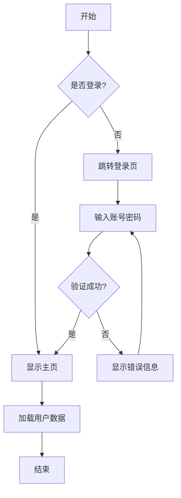
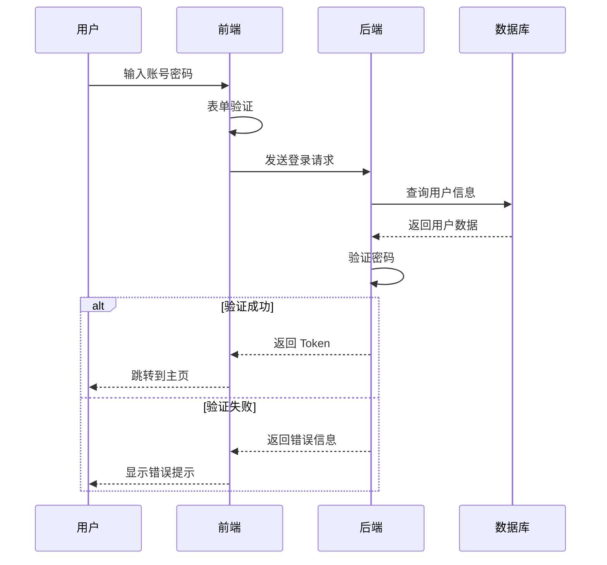
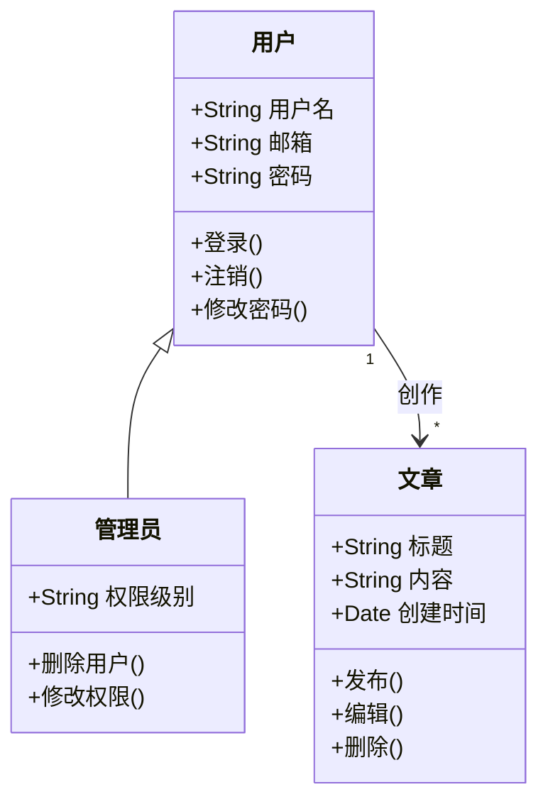
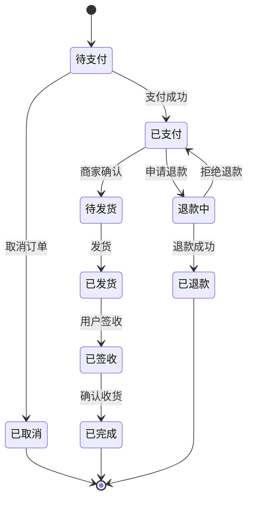
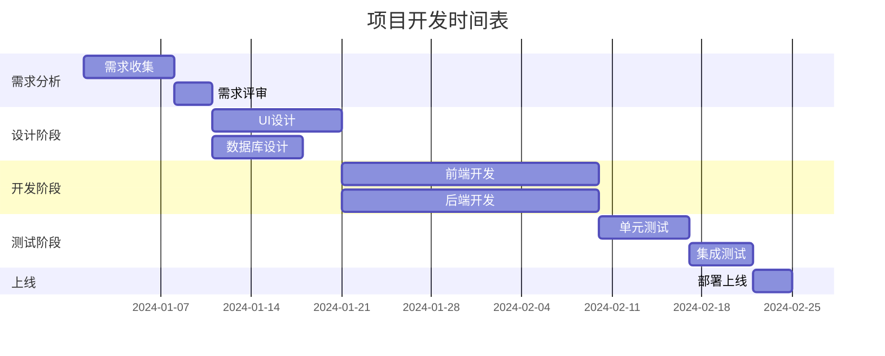
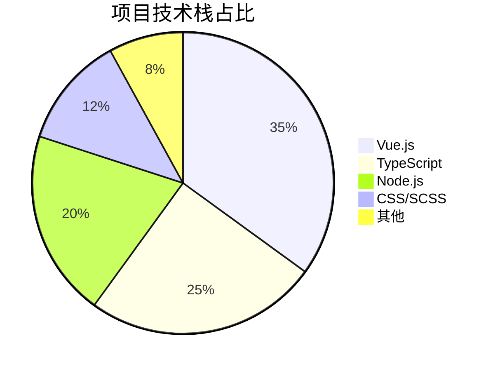
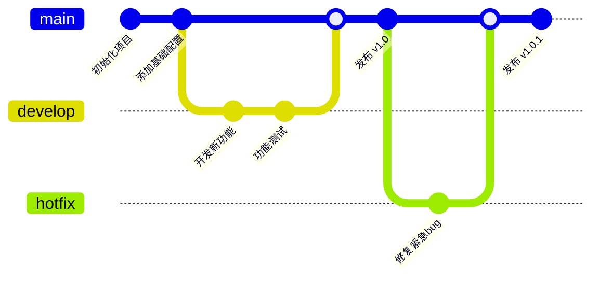
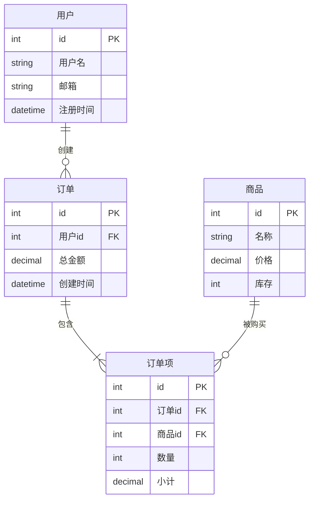
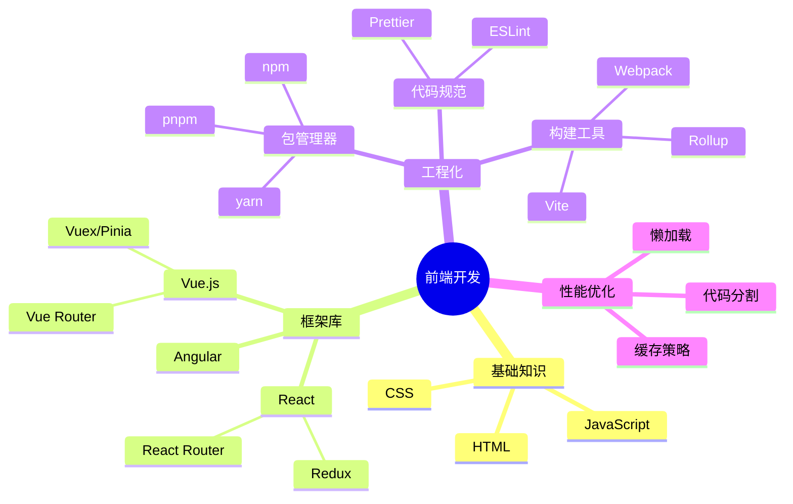

# Mermaid 图表示例

本页面展示如何在 VitePress 中使用 Mermaid 绘制各种类型的图表。

## 什么是 Mermaid？

Mermaid 是一个基于 JavaScript 的图表绘制工具，它使用类似 Markdown 的语法来创建和修改图表。通过简单的文本描述，你可以快速创建流程图、时序图、甘特图等多种类型的图表。

## 使用方法

在 Markdown 文档中使用 ` ```mermaid ` 代码块即可创建 Mermaid 图表：

## 流程图 (Flowchart)

流程图用于展示流程或系统中的步骤和决策点。

**示例：**



## 时序图 (Sequence Diagram)

时序图用于展示对象之间的交互顺序。

**示例：用户登录流程**



## 类图 (Class Diagram)

类图用于展示系统中类的结构和类之间的关系。

**示例：**



## 状态图 (State Diagram)

状态图用于展示对象在其生命周期中的不同状态。

**示例：订单状态流转**



## 甘特图 (Gantt Chart)

甘特图用于项目管理，展示项目进度和任务时间安排。

**示例：项目开发计划**



## 饼图 (Pie Chart)

饼图用于展示数据的占比关系。

**示例：技术栈占比**



## Git 图 (Git Graph)

Git 图用于展示 Git 分支和提交历史。

**示例：**



## 实体关系图 (ER Diagram)

实体关系图用于展示数据库中实体之间的关系。

**示例：**



## 思维导图 (Mindmap)

思维导图用于展示想法和概念之间的层次关系。

**示例：前端学习路线**



## 更多资源

- [Mermaid 官方文档](https://mermaid.js.org/)
- [Mermaid 在线编辑器](https://mermaid.live/)
- [图表语法参考](https://mermaid.js.org/intro/syntax-reference.html)
